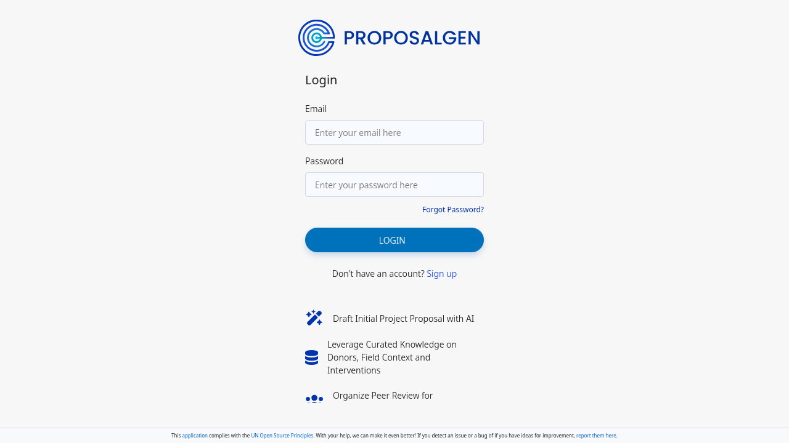
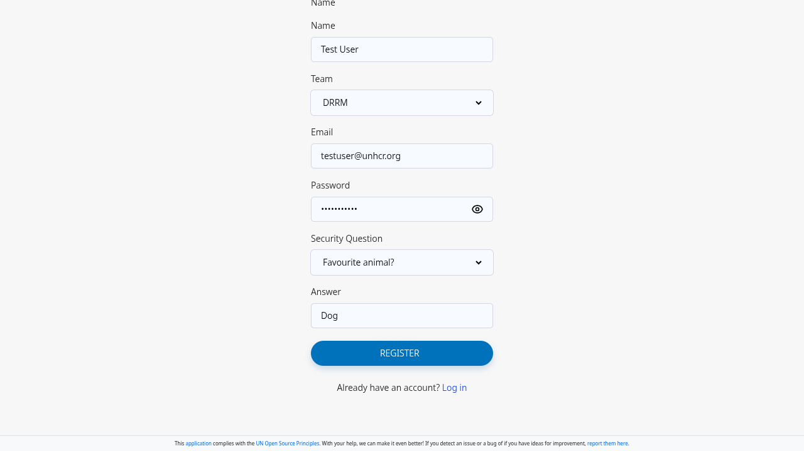
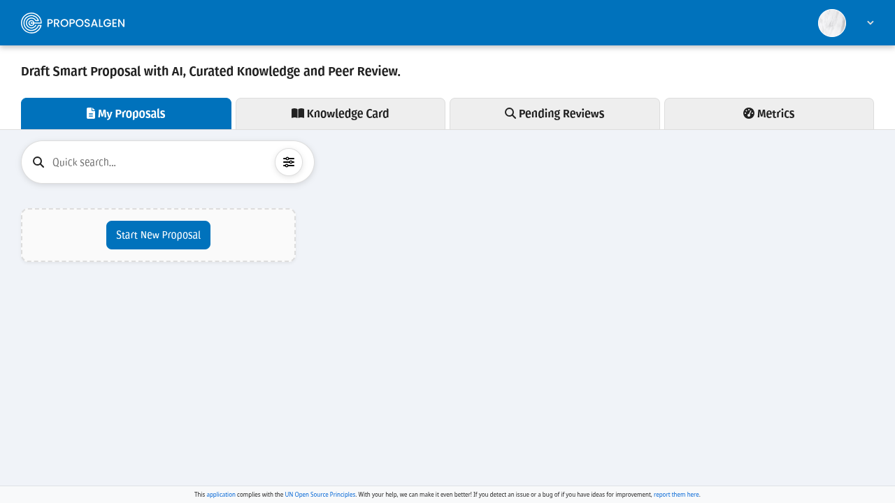
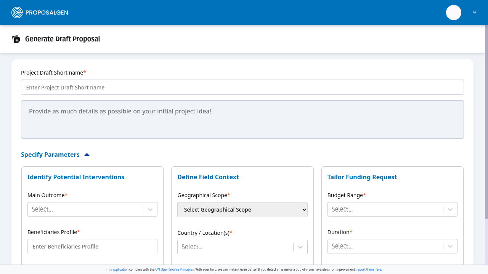
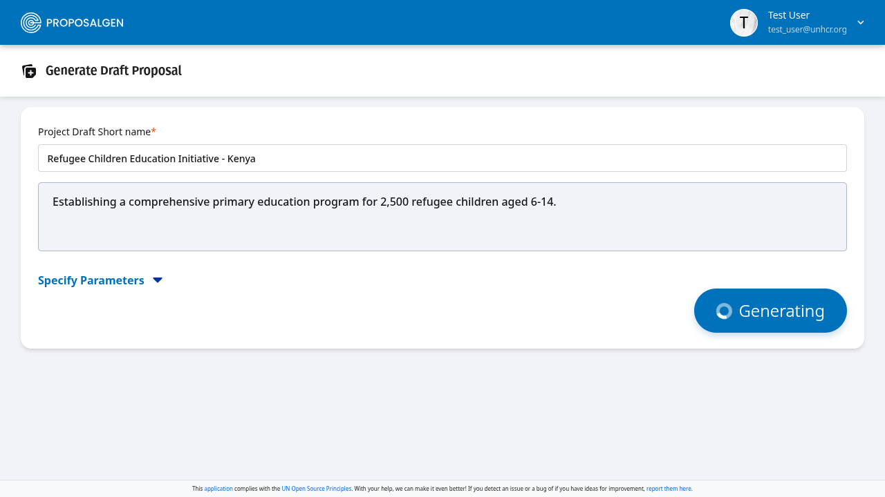
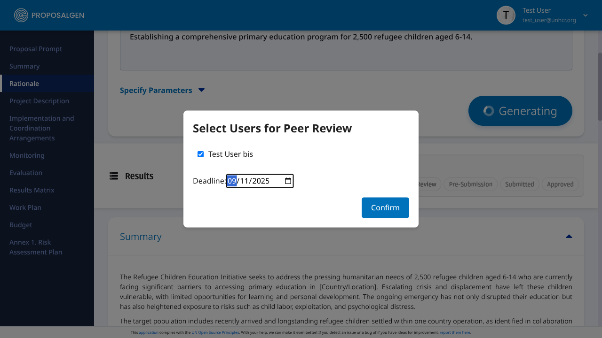
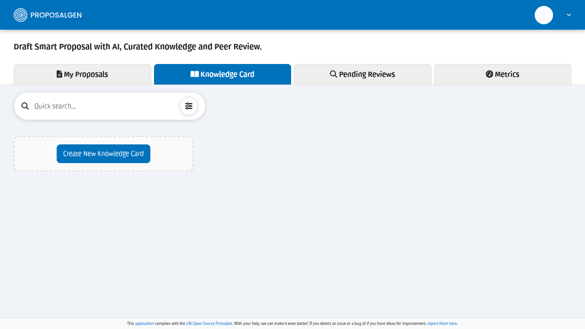
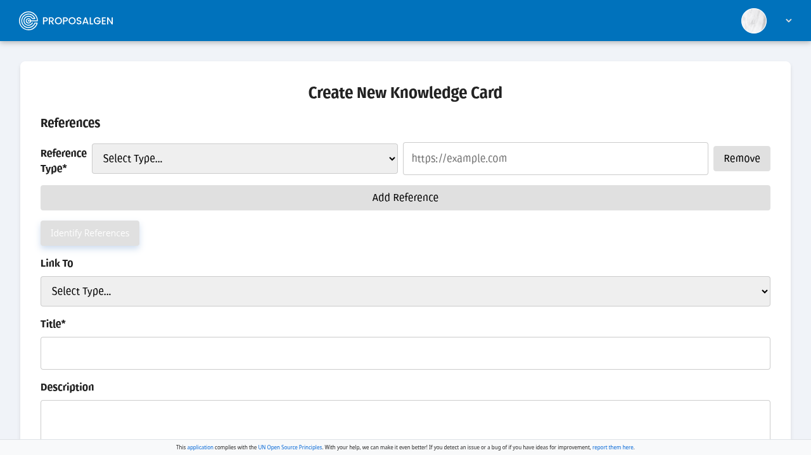

# Project Proposal Generator

__Empowering change-makers with AI-enhanced Proposal Drafting__

## Introduction

The Project Proposal Generator is an open-source, agentic AI system, designed to automate and enhance the creation of high-quality, structured project proposals. Tailored for UN agencies, NGOs, and mission-driven organizations, it ensures strategic alignment, compliance, and efficiency—turning complex requirements into compelling, submission-ready drafts.

### ✨ Why This Tool?

By streamlining proposal development, this tool accelerates funding opportunities, reduces manual effort, and ensures consistency—helping changemakers focus on impact, not paperwork.

- __AI-Powered Collaboration__: Simulates a real proposal team with specialized agents handling research, budgeting, and drafting.

- __Strategic Precision__: Aligns proposals with organizational priorities, findings from previous evaluations, donor guidelines, and thematic frameworks.

- __Adaptable & Open-Source__: Customizable for diverse sectors and editable by the community.

- __Seamless Export__: Generate, refine, and export proposals in Word/Excel with validation tracking.

## 🚀 Overview

The landing page is the first thing you'll see. From here, you can navigate to all the key features.

To get started, you'll need to register for an account. Click on the "Register" button on the landing page to go to the registration form.

Fill in your details in the __registration form__ as shown below.

Once you've filled in all the required fields, click the "Submit" button. You should see a confirmation that your registration was successful.

Once you are logged in, you can __generate a new proposal__. Navigate to the "Generate Proposal" page.

After you have filled out the necessary information, click "Generate". You will see a confirmation that your proposal has been created.

After a proposal is created, it can be sent for __peer review__. The peer review page allows you to view the proposal and provide feedback.

__Knowledge cards__ are a way to represent information in a concise and easy-to-digest format.

You can create new knowledge cards from the "Create Knowledge Card" page.

### 🌍 Key Features:

This system leverages the agent-based framework of [CrewAI](https://docs.crewai.com/introduction) to orchestrate multiple collaborative AI agents—each specialized in a core aspect of proposal writing such as context analysis, objectives formulation, and budgeting.

- 🤖 **Agentic Workflow**: Modular agents simulate a real project development team.
- 📝 **Proposal Structuring**: Outputs fully-structured, ready-to-submit project proposals.
- 🌍 **Alignment**: Integrates thematic priorities, templates, and compliance requirements.
- 🧩 **Contextual Adaptation**: Accepts input on target countries, population groups, and sectors of intervention.
- 📂 **Validation & Export**: Projects can be edit and refined, then exported to word and pdf and marked as validated.

## 🧱 System Architecture

Each agent is powered by an LLM and follows a role-specific prompt and toolset.

The key configuration files are in `backend/config/agents.yaml` and `backend/config/tasks.yaml`, which define the agents' roles, prompts, and tasks.
 
 

## 🛠️ Installation

Refer to [doc_running_local.md](https://github.com/edouard-legoupilproposal_drafter/blob/main/doc_running_local.md)

## 🔒 Security

This project prioritizes security to ensure the safe handling of sensitive information and the integrity of the proposal generation process. Our approach to security includes the following considerations:

*   **Data Privacy**: As the application is designed to work from Public Data Sources, elements related to Data Protection in relation Personally Identifiable Information do not apply.
*   **Secure Coding Practices**: We adhere to secure coding standards to minimize vulnerabilities. This includes practices like input validation to prevent common security flaws. A large part of the codebase has been created through [vibe coding](https://en.wikipedia.org/wiki/Vibe_coding) interactions with [Google Jules](https://jules.google.com) 
*   **Dependency Management**: We actively manage our open-source dependencies and use tools to scan for known vulnerabilities. We strive to keep all libraries up-to-date to protect against security threats.
*   **LLM Security**: For the AI components, we are mindful of risks such as prompt injection. We design our prompts and agentic workflows to be robust against malicious inputs and to ensure the Large Language Model (LLM) behaves within its intended scope.

## 🤝 Contributing

> 🚧 This project is licensed under the MIT License. It is in active development. Contributions are welcome!

The system uses multiple proposal structures and can be definitely adapted to other UN Humanitarian agencies (e.g., UNHCR, OCHA, UNICEF, WFP).

If you can contribute to the project, please follow these steps:
1. Fork the repo
2. Create a feature branch
3. Commit changes
4. Open a pull request

## 🌐 Alignment with UN Open Source Principles

The open source nature of this project allows for community contributions and adaptations, making it a versatile solution for various UN agencies and NGOs.

This project is committed to upholding the [UN Open Source Principles](https://unite.un.org/en/news/osi-first-endorse-united-nations-open-source-principles), ensuring it is a transparent, collaborative, and sustainable solution for the humanitarian community.

-   **Open by Default**: The Project Proposal Generator is built as an open-source tool from the ground up, making its codebase and development process accessible to everyone.
-   **Contribute Back**: We actively encourage and welcome contributions from the community to foster a vibrant ecosystem of developers and users.
-   **Secure by Design**: Security is a core consideration in our development lifecycle, ensuring that the tool is safe and reliable for all users.
-   **Foster Inclusive Participation**: We are dedicated to creating an inclusive environment where individuals from diverse backgrounds can contribute and feel empowered.
-   **Design for Reusability**: The modular architecture of the system allows for easy adaptation and integration with other platforms and ecosystems.
-   **Provide Documentation**: Comprehensive documentation is provided for end-users, integrators, and developers to ensure clarity and ease of use.
-   **RISE (Recognize, Incentivize, Support, and Empower)**: We aim to empower our community by recognizing contributions and providing the necessary support for active participation.
-   **Sustain and Scale**: The project is designed to be a long-term solution that can evolve and scale to meet the changing needs of the UN system and its partners.

## 🔮 Future Development: Strategic AI Enhancements

To further elevate the capabilities and value of the this Project Proposal Generator, the following potential enhancement could be delivered, each targeting critical pain points in the project development cycle. These future developments aim to transform this initial Proposal Generator into a comprehensive **AI-powered Project Management Suite**, aligning creativity with institutional wisdom and real-time intelligence to drive measurable impact.

---

###  💰 AI-Powered Budget Builder with Calibrated Costing Tool

**Pain Point:**  
Developing budgets that align with real costs and institutional norms is time-consuming and error-prone. There is often inconsistency in pricing across proposals and a lack of reference to standard costing.

**Solution:**  
An AI agent that generates budget lines using a calibrated costing tool referencing standard rates and historical financial data, in a similar approach than [IRC SCAN](https://www.rescue.org/sites/default/files/document/964/ircscantool2pager.pdf). The system ensures consistency, transparency, and realism in project budgeting.

**Added Benefits:**  
- Saves time and increases accuracy in budget development  
- Promotes financial coherence across projects and missions  
- Builds donor confidence through realistic and traceable costing  
- Facilitates rapid budget iteration for concept notes and revisions  

---

### 📝 AI-Supported Reporting & Documentation Toolkit

**Pain Point:**  
Project teams often struggle with reporting due to inconsistent formats, fragmented data sources, and unclear requirements. Generating accurate, timely, and donor-compliant reports can be burdensome, especially when field data is lacking or not well-structured.

**Solution:**  
An integrated module that provides tailored reporting templates aligned with donor and institutional requirements. It includes data collection form generators and AI assistants that help extract, summarize, and format content for interim and final reports.

**Added Benefits:**  
- Standardizes and simplifies reporting practices across projects  
- Reduces staff burden with ready-to-use templates and content suggestions  
- Increases quality, timeliness, and compliance of submitted reports  
- Supports continuous learning by linking reported outcomes to future project design  
- Facilitates better data collection through context-aware form generation

--------

## 📚 Project Background & References

This project was initially impulsed by [Edouard Legoupil](https://www.linkedin.com/in/edouardlegoupil/recent-activity/all/) during his secondment to IOM as Chief Data Officer. The [first version](https://github.com/iom/proposal_drafter) was developped with [Datamatics](https://www.datamatics.com/) through an initial seed funding from IOM, building on the [IOM Project Handbook](https://publications.iom.int/system/files/pdf/iom_project_handbook_6feb2012.pdf).

The last current releases and new features are developped to support the needs of UNHCR.

Similar (but Proprietary...) Projects

* [grantassistant](https://www.grantassistant.ai)
* [ai-grant-writing-assistant](https://www.grantable.co)
* [bidnexus](https://www.bidnexus.ai)

