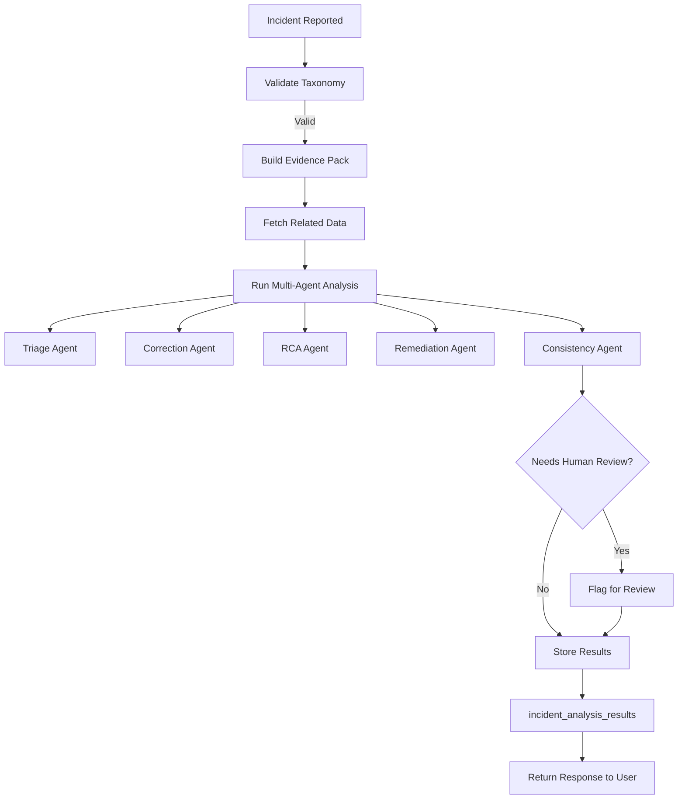

# Proposal Drafter Database Schema


## Overview

The Proposal Drafter application is designed to streamline the process of creating, reviewing, and managing project proposals for humanitarian and development organizations. This database schema supports a comprehensive workflow from proposal creation through peer review and knowledge management, with integrated SharePoint document management and template qualification systems.


```mermaid

erDiagram
    teams {
        UUID id PK
        string name UK
    }

    users {
        UUID id PK
        string email UK
        string password
        string name
        UUID team_id FK
        JSONB security_questions
        boolean session_active
        timestamptz created_at
        timestamptz updated_at
        string geographic_coverage_type
        string geographic_coverage_region
        string geographic_coverage_country
        INTEGER requested_role_id FK
    }

    roles {
        INTEGER id PK
        string name UK
    }

    user_roles {
        UUID user_id FK
        INTEGER role_id FK
    }

    user_role_requests {
        UUID user_id FK
        INTEGER role_id FK
    }

    user_donor_groups {
        UUID user_id FK
        string donor_group FK
    }

    user_donors {
        UUID user_id FK
        UUID donor_id FK
    }

    user_outcomes {
        UUID user_id FK
        UUID outcome_id FK
    }

    user_field_contexts {
        UUID user_id FK
        UUID field_context_id FK
    }

    donors {
        UUID id PK
        string account_id UK
        string name UK
        string country
        string donor_group
        UUID created_by FK
        timestamptz created_at
        timestamptz last_updated
    }

    outcomes {
        UUID id PK
        string name UK
        UUID created_by FK
        timestamptz created_at
        timestamptz last_updated
    }

    field_contexts {
        UUID id PK
        string title
        string name UK
        string category
        string geographic_coverage
        string unhcr_region
        UUID created_by FK
        timestamptz created_at
        timestamptz last_updated
    }

    proposals {
        UUID id PK
        UUID user_id FK
        string template_name
        JSONB form_data
        text project_description
        JSONB generated_sections
        JSONB reviews
        boolean is_accepted
        proposal_status status
        string contribution_id
        UUID created_by FK
        timestamptz created_at
        UUID updated_by FK
        timestamptz updated_at
        UUID template_registry_id FK
        UUID template_version_id FK
    }

    proposal_status_history {
        UUID id PK
        UUID proposal_id FK
        proposal_status status
        JSONB generated_sections_snapshot
        timestamptz created_at
    }

    proposal_peer_reviews {
        UUID id PK
        UUID proposal_id FK
        UUID reviewer_id FK
        UUID proposal_status_history_id FK
        string section_name
        string rating
        string status
        timestamptz deadline
        text review_text
        text author_response
        string author_response_by
        string type_of_comment
        string severity
        timestamptz created_at
        timestamptz updated_at
    }

    knowledge_cards {
        UUID id PK
        string template_name
        string type
        text summary
        JSONB generated_sections
        boolean is_accepted
        proposal_status status
        UUID donor_id FK
        UUID outcome_id FK
        UUID field_context_id FK
        UUID created_by FK
        timestamptz created_at
        UUID updated_by FK
        timestamptz updated_at
        UUID template_registry_id FK
        UUID template_version_id FK
    }

    knowledge_card_history {
        UUID id PK
        UUID knowledge_card_id FK
        JSONB generated_sections_snapshot
        UUID created_by FK
        timestamptz created_at
    }

    knowledge_card_reviews {
        UUID id PK
        UUID knowledge_card_id FK
        UUID reviewer_id FK
        string section_name
        string rating
        text review_text
        text author_response
        string author_response_by
        string type_of_comment
        string severity
        string status
        timestamptz created_at
        timestamptz updated_at
    }

    knowledge_card_references {
        UUID id PK
        string url UK
        string reference_type
        text summary
        UUID created_by FK
        timestamptz created_at
        UUID updated_by FK
        timestamptz updated_at
        timestamptz scraped_at
        boolean scraping_error
    }

    knowledge_card_to_references {
        UUID knowledge_card_id FK
        UUID reference_id FK
    }

    knowledge_card_reference_vectors {
        UUID id PK
        UUID reference_id FK
        text text_chunk
        vector embedding
    }

    knowledge_card_usage {
        UUID id PK
        UUID knowledge_card_id FK
        UUID user_id FK
        string action
        UUID proposal_id FK
        timestamptz created_at
    }

    knowledge_card_reference_errors {
        UUID id PK
        UUID reference_id FK
        string error_type
        text error_message
        timestamptz created_at
    }

    incident_analysis_results {
        UUID id PK
        string artifact_type
        string source_review_id FK
        UUID proposal_id FK
        UUID knowledge_card_id FK
        UUID template_request_id FK
        string incident_type
        string severity
        string status
        JSONB analysis_payload
        timestamptz created_at
        timestamptz updated_at
    }

    rag_evaluation_logs {
        UUID id PK
        UUID knowledge_card_id FK
        text query
        text retrieved_context
        text generated_answer
        timestamptz created_at
        timestamptz updated_at
    }

    donor_template_comments {
        UUID id PK
        UUID template_request_id FK
        string template_name
        UUID user_id FK
        text comment_text
        string section_name
        string rating
        string severity
        string type_of_comment
        string author_response
        string author_response_by
        string status
        timestamptz created_at
    }

    donor_template_requests {
        UUID id PK
        string name
        UUID donor_id FK
        UUID[] donor_ids
        string template_type
        JSONB configuration
        JSONB initial_file_content
        string status
        UUID created_by FK
        timestamptz created_at
        timestamptz updated_at
    }

    template_registry {
        UUID id PK
        string template_key UK
        string template_name
        string template_type
        UUID source_template_request_id FK
        UUID owner_user_id FK
        UUID owning_team_id FK
        text description
        boolean active
        timestamptz created_at
        timestamptz updated_at
    }

    template_versions {
        UUID id PK
        UUID template_registry_id FK
        UUID template_id FK
        string version_label
        string version_number
        string version_notes
        release_environment environment
        template_version_status status
        UUID cloned_from_version_id FK
        JSONB configuration
        JSONB template_content
        JSONB initial_file_content
        text release_notes
        JSONB template_data
        UUID created_by FK
        timestamptz created_at
        UUID updated_by FK
        timestamptz updated_at
        timestamptz promoted_at
        UUID promoted_by FK
        timestamptz suspended_at
        UUID suspended_by FK
    }

    qualification_rule_sets {
        UUID id PK
        string name UK
        string template_type
        string version_label
        boolean is_active
        text description
        UUID created_by FK
        timestamptz created_at
        UUID updated_by FK
        timestamptz updated_at
    }

    qualification_rules {
        UUID id PK
        UUID rule_set_id FK
        string rule_code
        string rule_name
        string category
        string severity
        string applies_to
        string evaluation_mode
        string metric_name
        string comparator
        NUMERIC threshold_numeric
        JSONB threshold_json
        NUMERIC weight
        boolean required
        text description
        text remediation_guidance
        boolean is_active
        timestamptz created_at
    }

    qualification_scenarios {
        UUID id PK
        string scenario_code UK
        string template_type
        string name
        text description
        UUID donor_id FK
        UUID outcome_id FK
        UUID field_context_id FK
        JSONB geography
        JSONB metadata
        boolean active
        UUID created_by FK
        timestamptz created_at
    }

    template_qualification_runs {
        UUID id PK
        UUID template_version_id FK
        UUID rule_set_id FK
        string run_name
        release_environment environment
        qualification_run_status status
        INTEGER target_sample_size
        INTEGER actual_sample_size
        INTEGER required_reviewer_count
        timestamptz started_at
        timestamptz completed_at
        NUMERIC overall_score
        qualification_decision decision
        text decision_reason
        UUID initiated_by FK
        UUID approved_by FK
        timestamptz created_at
        timestamptz updated_at
    }

    template_qualification_run_scenarios {
        UUID id PK
        UUID qualification_run_id FK
        UUID scenario_id FK
        boolean is_required
        boolean executed
        text notes
    }

    qualification_evidence_items {
        UUID id PK
        UUID qualification_run_id FK
        string source_artifact_type
        UUID source_id
        string source_table
        UUID proposal_id FK
        UUID knowledge_card_id FK
        UUID template_request_id FK
        UUID scenario_id FK
        string section_name
        string severity
        string incident_type
        string rating
        JSONB evidence_payload
        timestamptz created_at
    }

    qualification_rule_evaluations {
        UUID id PK
        UUID qualification_run_id FK
        UUID rule_id FK
        qualification_rule_result result
        NUMERIC metric_value
        JSONB metric_payload
        text explanation
        UUID waived_by FK
        text waiver_reason
        string artifact_type
        string artifact_id
        timestamptz created_at
    }

    template_qualification_signoffs {
        UUID id PK
        UUID qualification_run_id FK
        UUID reviewer_id FK
        string role_name
        string decision
        text comments
        timestamptz signed_at
    }

    template_release_history {
        UUID id PK
        UUID template_version_id FK
        UUID qualification_run_id FK
        string action
        release_environment from_environment
        release_environment to_environment
        template_version_status previous_status
        template_version_status new_status
        text reason
        UUID actioned_by FK
        timestamptz created_at
    }

    qualification_waivers {
        UUID id PK
        UUID qualification_run_id FK
        UUID rule_id FK
        UUID approved_by FK
        text reason
        timestamptz expires_at
        timestamptz created_at
    }

    proposal_donors {
        UUID proposal_id FK
        UUID donor_id FK
    }

    proposal_outcomes {
        UUID proposal_id FK
        UUID outcome_id FK
    }

    proposal_field_contexts {
        UUID proposal_id FK
        UUID field_context_id FK
    }

    templates {
        UUID id PK
        string name
        string filename UK
        template_type template_type
        text description
        template_status status
        boolean is_default
        UUID created_by FK
        timestamptz created_at
        UUID updated_by FK
        timestamptz updated_at
    }

    template_donors {
        UUID template_id FK
        UUID donor_id FK
        UUID created_by FK
        timestamptz created_at
    }

    template_audit_log {
        UUID id PK
        UUID template_id FK
        UUID template_version_id FK
        string action
        JSONB action_details
        UUID performed_by FK
        timestamptz performed_at
    }

    artifact_runs {
        UUID id PK
        string artifact_type
        UUID artifact_id
        UUID user_id FK
        run_status run_status
        timestamptz start_time
        timestamptz end_time
        TEXT[] agents_executed
        string model_deployment
        INTEGER tokens_input
        INTEGER tokens_output
        NUMERIC estimated_cost
        INTEGER step_count
        INTEGER retry_count
        INTEGER failure_count
        INTEGER total_latency_ms
        JSONB stage_latencies
        INTEGER sections_generated
        INTEGER pages_generated
        INTEGER words_generated
        JSONB export_events
        string template_name
        string template_version
        JSONB metadata
        timestamptz created_at
        timestamptz updated_at
    }

    proposal_sharepoint_links {
        UUID id PK
        UUID proposal_id FK
        UUID user_id FK
        string sharepoint_url
        string filename
        string folder_path
        string file_id
        string file_version
        sharepoint_status status
        sharepoint_error_type error_type
        string error_message
        INTEGER retry_count
        timestamptz last_attempt_at
        timestamptz uploaded_at
        timestamptz expires_at
        timestamptz created_at
        timestamptz updated_at
    }

    knowledge_card_sharepoint_links {
        UUID id PK
        UUID knowledge_card_id FK
        UUID user_id FK
        string sharepoint_url
        string filename
        string folder_path
        string file_id
        string file_version
        sharepoint_status status
        sharepoint_error_type error_type
        string error_message
        INTEGER retry_count
        timestamptz last_attempt_at
        timestamptz uploaded_at
        timestamptz expires_at
        timestamptz created_at
        timestamptz updated_at
    }

    sharepoint_upload_events {
        UUID id PK
        string event_type
        string artifact_type
        UUID artifact_id
        UUID user_id FK
        UUID sharepoint_link_id
        sharepoint_status status
        sharepoint_error_type error_type
        string error_message
        JSONB metadata
        timestamptz created_at
    }

    sharepoint_sync_history {
        UUID id PK
        timestamptz sync_started_at
        timestamptz sync_completed_at
        sharepoint_sync_status status
        INTEGER total_files_checked
        INTEGER files_changed
        INTEGER files_created
        INTEGER files_deleted
        INTEGER errors_encountered
        JSONB error_summary
        timestamptz created_at
    }

    sharepoint_file_versions {
        UUID id PK
        string artifact_type
        UUID artifact_id
        UUID user_id FK
        UUID sharepoint_link_id
        INTEGER version_number
        string sharepoint_url
        string filename
        BIGINT file_size
        string sharepoint_version
        timestamptz last_modified_at
        string last_modified_by
        text diff_from_previous
        sync_change_type change_type
        JSONB metadata
        boolean is_current
        timestamptz created_at
    }

    teams ||--o{ users : belongs_to
    users ||--o{ roles : "has many through user_roles"
    users ||--o{ donors : creates
    users ||--o{ outcomes : creates
    users ||--o{ field_contexts : creates
    users ||--o{ proposals : creates
    users ||--o{ proposals : updates
    users ||--o{ knowledge_cards : creates
    users ||--o{ knowledge_cards : updates
    users ||--o{ knowledge_card_history : creates
    users ||--o{ knowledge_card_references : creates
    users ||--o{ knowledge_card_references : updates
    users ||--o{ knowledge_card_reviews : reviews
    users ||--o{ proposal_peer_reviews : reviews
    users ||--o{ donor_template_comments : creates
    users ||--o{ template_registry : owns
    users ||--o{ template_versions : creates
    users ||--o{ templates : creates
    users ||--o{ qualification_rule_sets : creates
    users ||--o{ qualification_scenarios : creates
    users ||--o{ template_qualification_runs : initiates
    users ||--o{ template_qualification_signoffs : signs
    users ||--o{ template_release_history : actions
    users ||--o{ qualification_waivers : approves
    users ||--o{ artifact_runs : executes
    users ||--o{ proposal_sharepoint_links : uploads
    users ||--o{ knowledge_card_sharepoint_links : uploads
    users ||--o{ sharepoint_upload_events : triggers
    users ||--o{ sharepoint_file_versions : modifies

    roles ||--o{ user_roles : "has many"
    roles ||--o{ user_role_requests : "has many"
    user_roles }|--|| users : "belongs to"
    user_roles }|--|| roles : "belongs to"
    user_role_requests }|--|| users : "belongs to"
    user_role_requests }|--|| roles : "belongs to"

    users ||--o{ user_donor_groups : "has many"
    users ||--o{ user_donors : "has many"
    users ||--o{ user_outcomes : "has many"
    users ||--o{ user_field_contexts : "has many"
    user_donor_groups }|--|| users : "belongs to"
    user_donors }|--|| users : "belongs to"
    user_donors }|--|| donors : "belongs to"
    user_outcomes }|--|| users : "belongs to"
    user_outcomes }|--|| outcomes : "belongs to"
    user_field_contexts }|--|| users : "belongs to"
    user_field_contexts }|--|| field_contexts : "belongs to"

    proposals ||--o{ proposal_status_history : has
    proposals ||--o{ proposal_peer_reviews : has
    proposals ||--o{ artifact_runs : has
    proposals }o--o{ donors : "has many through proposal_donors"
    proposals }o--o{ outcomes : "has many through proposal_outcomes"
    proposals }o--o{ field_contexts : "has many through proposal_field_contexts"
    proposals }|--|| template_registry : "uses"
    proposals }|--|| template_versions : "uses"
    proposals ||--o{ proposal_sharepoint_links : "has one per user"
    proposals ||--o{ sharepoint_file_versions : "has many"

    knowledge_cards ||--o{ knowledge_card_history : has
    knowledge_cards ||--o{ knowledge_card_reviews : has
    knowledge_cards ||--o{ knowledge_card_references : "has many through knowledge_card_to_references"
    knowledge_cards ||--o{ knowledge_card_usage : has
    knowledge_cards ||--o{ rag_evaluation_logs : has
    knowledge_cards ||--o{ artifact_runs : has
    knowledge_cards }|--|| template_registry : "uses"
    knowledge_cards }|--|| template_versions : "uses"
    knowledge_cards ||--o{ knowledge_card_sharepoint_links : "has one per user"
    knowledge_cards ||--o{ sharepoint_file_versions : "has many"

    knowledge_cards }|--|| donors : "optional link to"
    knowledge_cards }|--|| outcomes : "optional link to"
    knowledge_cards }|--|| field_contexts : "optional link to"

    knowledge_card_references ||--o{ knowledge_card_reference_vectors : has
    knowledge_card_references ||--o{ knowledge_card_reference_errors : has
    knowledge_card_references ||--o{ knowledge_card_to_references : "has many"
    knowledge_card_to_references }|--|| knowledge_cards : "belongs to"
    knowledge_card_to_references }|--|| knowledge_card_references : "belongs to"

    proposal_status_history ||--o{ proposal_peer_reviews : references

    incident_analysis_results }|--|| proposals : "optional link to"
    incident_analysis_results }|--|| knowledge_cards : "optional link to"
    incident_analysis_results }|--|| donor_template_requests : "optional link to"

    donor_template_requests ||--o{ donor_template_comments : has
    donor_template_requests }|--|| donors : "optional link to"

    template_registry ||--o{ template_versions : has
    template_registry }|--|| users : "owned by"
    template_registry }|--|| teams : "optional team"

    template_versions ||--o{ template_qualification_runs : has
    template_versions }|--|| template_versions : "cloned from"
    template_versions }|--|| templates : "references"

    templates ||--o{ template_donors : "has many"
    templates ||--o{ template_audit_log : "has many"
    templates }|--|| users : "created by"

    template_donors }|--|| templates : "belongs to"
    template_donors }|--|| donors : "belongs to"

    template_audit_log }|--|| templates : "belongs to"
    template_audit_log }|--|| template_versions : "optional version"
    template_audit_log }|--|| users : "performed by"

    artifact_runs }|--|| users : "executed by"

    qualification_rule_sets ||--o{ qualification_rules : has

    qualification_scenarios }|--|| donors : "optional link to"
    qualification_scenarios }|--|| outcomes : "optional link to"
    qualification_scenarios }|--|| field_contexts : "optional link to"

    template_qualification_runs ||--o{ template_qualification_run_scenarios : has
    template_qualification_runs ||--o{ qualification_evidence_items : has
    template_qualification_runs ||--o{ qualification_rule_evaluations : has
    template_qualification_runs ||--o{ template_qualification_signoffs : has
    template_qualification_runs ||--o{ template_release_history : has
    template_qualification_runs ||--o{ qualification_waivers : has
    template_qualification_runs }|--|| qualification_rule_sets : "uses"

    template_qualification_run_scenarios }|--|| template_qualification_runs : "belongs to"
    template_qualification_run_scenarios }|--|| qualification_scenarios : "belongs to"

    qualification_evidence_items }|--|| template_qualification_runs : "belongs to"
    qualification_evidence_items }|--|| proposals : "optional link to"
    qualification_evidence_items }|--|| knowledge_cards : "optional link to"
    qualification_evidence_items }|--|| donor_template_requests : "optional link to"
    qualification_evidence_items }|--|| qualification_scenarios : "optional link to"

    qualification_rule_evaluations }|--|| template_qualification_runs : "belongs to"
    qualification_rule_evaluations }|--|| qualification_rules : "belongs to"
    qualification_rule_evaluations }|--|| users : "optional waived by"

    template_qualification_signoffs }|--|| template_qualification_runs : "belongs to"
    template_qualification_signoffs }|--|| users : "signed by"

    template_release_history }|--|| template_versions : "belongs to"
    template_release_history }|--|| template_qualification_runs : "optional link to"
    template_release_history }|--|| users : "actioned by"

    qualification_waivers }|--|| template_qualification_runs : "belongs to"
    qualification_waivers }|--|| qualification_rules : "belongs to"
    qualification_waivers }|--|| users : "approved by"

    proposals ||--o{ proposal_donors : "has many"
    donors ||--o{ proposal_donors : "has many"
    proposal_donors }|--|| proposals : "belongs to"
    proposal_donors }|--|| donors : "belongs to"

    proposals ||--o{ proposal_outcomes : "has many"
    outcomes ||--o{ proposal_outcomes : "has many"
    proposal_outcomes }|--|| proposals : "belongs to"
    proposal_outcomes }|--|| outcomes : "belongs to"

    proposals ||--o{ proposal_field_contexts : "has many"
    field_contexts ||--o{ proposal_field_contexts : "has many"
    proposal_field_contexts }|--|| proposals : "belongs to"
    proposal_field_contexts }|--|| field_contexts : "belongs to"

    proposals ||--o{ proposal_sharepoint_links : "has many"
    proposal_sharepoint_links }|--|| proposals : "belongs to"
    proposal_sharepoint_links }|--|| users : "uploaded by"
    proposal_sharepoint_links ||--o{ sharepoint_upload_events : "has many"
    proposal_sharepoint_links ||--o{ sharepoint_file_versions : "has many"

    knowledge_cards ||--o{ knowledge_card_sharepoint_links : "has many"
    knowledge_card_sharepoint_links }|--|| knowledge_cards : "belongs to"
    knowledge_card_sharepoint_links }|--|| users : "uploaded by"
    knowledge_card_sharepoint_links ||--o{ sharepoint_upload_events : "has many"
    knowledge_card_sharepoint_links ||--o{ sharepoint_file_versions : "has many"

    sharepoint_upload_events }|--|| users : "triggered by"
    sharepoint_upload_events }|--|| proposal_sharepoint_links : "optional link"
    sharepoint_upload_events }|--|| knowledge_card_sharepoint_links : "optional link"

    sharepoint_file_versions }|--|| users : "modified by"
    sharepoint_file_versions }|--|| proposal_sharepoint_links : "belongs to"
    sharepoint_file_versions }|--|| knowledge_card_sharepoint_links : "belongs to"

    sharepoint_sync_history ||--o{ sharepoint_file_versions : "tracks"
```

## Core Entities

### Users & Teams

 * Users represent individual team members with authentication credentials and security questions
 * Teams group users together for organizational purposes
 * Each user belongs to one team, supporting collaborative work environments
 * Users can have multiple roles through the user_roles join table
 * Role requests are managed through user_role_requests for approval workflows
 * Users can be associated with donor groups, specific donors, outcomes, and field contexts for personalized content recommendations

### Templates System

The `templates` table provides a file-based template management system:
 * **name**: Human-readable template name
 * **filename**: Unique filename identifier (e.g., "proposal_template_unhcr.json")
 * **template_type**: Enum (proposal, concept_note, knowledge_card)
 * **status**: Enum (draft, active, deprecated, archived)
 * **is_default**: Flag indicating if this is the default template for its type
 * **description**: Template description
 * Linked to donors through `template_donors` join table for donor-specific templates
 * Audit logging through `template_audit_log` for all template modifications

The `template_registry` and `template_versions` tables provide a canonical registry:
 * **template_registry**: Canonical template definitions with unique keys
 * **template_versions**: Immutable version tracking with environment (UAT/PROD) and status
 * Supports cloning through `cloned_from_version_id`
 * Tracks promotion, suspension, and retirement lifecycle

### Proposal Management

#### Proposals

The central entity representing project proposals with:
 * Form data stored as JSON for flexible field structures
 * Generated sections containing AI-generated content
 * Status tracking through an enum type (draft, in_review, pre_submission, submitted, deleted, generating_sections, failed)
 * Review system with peer feedback mechanisms
 * Version control through status history snapshots
 * Template registry and versioning support for standardized proposal structures

#### Artifact Runs

The `artifact_runs` table tracks execution metrics for both proposals and knowledge cards:
 * **run_status**: Enum (drafting, completed, failed, cancelled)
 * **agents_executed**: Array of agent names that ran
 * **model_deployment**: Model/deployment identifier used
 * **Token tracking**: Input/output tokens and estimated cost
 * **Performance metrics**: Step count, retry count, failure count, latency
 * **Output metrics**: Sections generated, pages generated, words generated
 * **Export events**: JSONB tracking Word/PDF export events with timestamps
 * **Timing**: Start/end times and stage-level latencies

### Proposal Relationships

Proposals can be linked to multiple:
 * Donors - funding organizations
 * Outcomes - desired results or impact areas
 * Field Contexts - geographical and thematic focus areas

These many-to-many relationships are managed through join tables (proposal_donors, proposal_outcomes, proposal_field_contexts).

## Knowledge Management

### Knowledge Cards

Reusable content components that serve as a knowledge base:
 * Can be linked to one of: Donor, Outcome, or Field Context (enforced by constraint)
 * Store generated content sections for reuse across proposals
 * Maintain version history through snapshots
 * Support reference management with web scraping capabilities
 * Track usage patterns through knowledge_card_usage table
 * Support peer review workflows through knowledge_card_reviews
 * Linked to template registry and versions for tracking

### Knowledge Card References

 * Store external references and resources
 * Support vector embeddings for semantic search (knowledge_card_reference_vectors)
 * Include scraping status and error tracking
 * Enable AI-powered content recommendations
 * Track reference errors through knowledge_card_reference_errors
 * Many-to-many relationship with knowledge cards through knowledge_card_to_references join table

### RAG Evaluation Logs

The `rag_evaluation_logs` table captures retrieval-augmented generation interactions:
 * **Query Tracking**: Original user queries
 * **Retrieved Context**: Source documents and references used
 * **Generated Answers**: AI-produced responses
 * **Knowledge Card Link**: Association with specific knowledge cards

## Workflow Support

### Peer Review System

 * Proposal Peer Reviews allow multiple reviewers to provide feedback
 * Section-specific comments with severity ratings
 * Author response tracking with `author_response_by` field
 * Deadline management for review cycles
 * Knowledge Card Reviews extend peer review to knowledge management

### Status Tracking

 * Proposal Status History maintains complete audit trails
 * Snapshots of generated sections at each status change
 * Supports rollback and version comparison

## Template Management System

### Template Registry

 * Centralized template management through template_registry table
 * Supports both proposal and knowledge card templates
 * Version control through template_versions with environment tracking (UAT/PROD)
 * Template cloning and evolution through cloned_from_version_id
 * Ownership and team management for collaborative template development

### Template Qualification Workflow

 * Quality assurance through qualification_rule_sets and qualification_rules
 * Scenario-based testing with qualification_scenarios
 * Comprehensive qualification runs tracked in template_qualification_runs
 * Evidence collection through qualification_evidence_items
 * Rule evaluation and compliance tracking via qualification_rule_evaluations
 * Multi-stakeholder signoff process with template_qualification_signoffs
 * Release management and promotion history in template_release_history
 * Waiver system for exceptions through qualification_waivers

## SharePoint Integration

The database includes comprehensive SharePoint integration for document management:

### SharePoint Document Links

 * **proposal_sharepoint_links**: Stores SharePoint URLs and metadata for proposals per user
 * **knowledge_card_sharepoint_links**: Stores SharePoint URLs and metadata for knowledge cards per user
 * **Status tracking**: sharepoint_status enum (pending, uploading, uploaded, failed, expired)
 * **Error handling**: sharepoint_error_type enum with specific error categories
 * **Retry mechanism**: Retry count and last attempt tracking
 * **Expiration**: Document expiration tracking for temporary links

### SharePoint Upload Events

 * **sharepoint_upload_events**: Tracks all upload-related events
 * **event_type**: upload_started, upload_success, upload_failed, retry_attempt, url_retrieved, access_error
 * **artifact_type**: proposal or knowledge_card
 * **Metadata**: JSONB field for additional event data

### SharePoint Sync System

 * **sharepoint_sync_history**: Tracks synchronization runs between database and SharePoint
 * **sharepoint_sync_status**: pending, started, completed, failed
 * **Metrics**: Files checked, changed, created, deleted, errors encountered
 * **Error summary**: JSONB aggregation of sync errors

### File Version History

 * **sharepoint_file_versions**: Complete version history for SharePoint files
 * **change_type**: sync_change_type enum (created, modified, deleted, renamed)
 * **Version tracking**: version_number, sharepoint_version, is_current flag
 * **Diff tracking**: diff_from_previous for content comparison
 * **Metadata**: File size, last modified info, SharePoint metadata

### SharePoint Views

 * **vw_sharepoint_upload_status**: Unified view of upload status across proposals and knowledge cards
 * **vw_file_version_history**: Complete history of file versions with artifact context
 * **vw_sync_history_details**: Sync run details with duration calculations

### SharePoint Functions

 * **get_valid_sharepoint_link**: Returns the latest valid link for an artifact, with needs_retry flag
 * **get_file_version_history**: Returns version history with diff previews

## Incident Management System

### Incident Analysis Results

The `incident_analysis_results` table stores comprehensive analysis of quality issues and incidents:
 * **Artifact Types**: proposal, knowledge_card, template
 * **Severity Levels**: P0 (Critical), P1 (High), P2 (Medium), P3 (Low)
 * **Incident Types**: Taxonomy-based classification (Factual Error, Compliance Violation, etc.)
 * **Analysis Payload**: Complete JSON analysis including root cause, suggestions, and remediation
 * **Status Tracking**: Analysis lifecycle management
 * **Source Linkage**: Links to proposals, knowledge cards, or template requests

## Technical Features

### Data Types & Extensions

 * Vector extension for AI-powered semantic search (1536-dimensional embeddings)
 * JSONB for flexible schema-less data storage
 * UUID primary keys for distributed system compatibility
 * Enum types for controlled status values:
   - proposal_status: draft, in_review, pre_submission, submitted, deleted, generating_sections, failed
   - template_type: proposal, concept_note, knowledge_card
   - template_status: draft, active, deprecated, archived
   - release_environment: uat, prod
   - template_version_status: draft, in_uat, conditionally_qualified, qualified, disqualified, promoted_to_prod, suspended, retired
   - run_status: drafting, completed, failed, cancelled
   - sharepoint_status: pending, uploading, uploaded, failed, expired
   - sharepoint_error_type: authentication_error, connection_error, upload_error, metadata_error, quota_exceeded, permission_error, file_exists, unknown_error
   - sharepoint_sync_status: pending, started, completed, failed
   - sync_change_type: created, modified, deleted, renamed
   - qualification_run_status: draft, collecting_evidence, evaluating, pending_signoff, approved, rejected, cancelled
   - qualification_rule_result: pass, fail, waived, not_applicable
   - qualification_decision: qualified, conditionally_qualified, disqualified, suspended, rolled_back
   - managed_template_type: proposal, knowledge_card, concept_note

### Constraints & Validation

 * Unique constraints prevent duplicate entities
 * Check constraints ensure data integrity (e.g., knowledge card linking rules, artifact type validation)
 * Foreign key constraints maintain referential integrity with appropriate cascade behaviors
 * Timestamp tracking for audit purposes with automated triggers
 * Complex validation rules for template qualification workflows
 * Knowledge card constraint: Can link to at most one of donor, outcome, or field context

## Key Relationships

### One-to-Many

 * Team → Users
 * User → Created entities (proposals, knowledge cards, templates, etc.)
 * Proposal → Status History entries
 * Knowledge Card → Reference entries
 * Knowledge Card → Usage tracking
 * Knowledge Card → Reviews
 * Template Registry → Template Versions
 * Qualification Run → Evidence Items, Rule Evaluations, Signoffs
 * Proposal → SharePoint Links (one per user)
 * Knowledge Card → SharePoint Links (one per user)
 * SharePoint Link → Upload Events
 * SharePoint Link → File Versions

### Many-to-Many

 * Proposals ↔ Donors (through proposal_donors)
 * Proposals ↔ Outcomes (through proposal_outcomes)
 * Proposals ↔ Field Contexts (through proposal_field_contexts)
 * Users ↔ Roles (through user_roles)
 * Users ↔ Donor Groups (through user_donor_groups)
 * Users ↔ Specific Donors (through user_donors)
 * Users ↔ Outcomes (through user_outcomes)
 * Users ↔ Field Contexts (through user_field_contexts)
 * Knowledge Cards ↔ References (through knowledge_card_to_references)
 * Qualification Runs ↔ Scenarios (through template_qualification_run_scenarios)
 * Templates ↔ Donors (through template_donors)

### Optional Links

 * Knowledge Cards can optionally link to one related entity (donor, outcome, or field context)
 * Proposals can optionally link to template registry and versions
 * Incident analysis can link to proposals, knowledge cards, or template requests
 * Template versions can be cloned from other versions
 * Template versions can reference templates

## Indexing Strategy

The schema includes strategic indexes on:
 * User email for authentication
 * Foreign key columns for join performance
 * Proposal and knowledge card relationships
 * Review and status tracking tables
 * Template registry and version lookups
 * Qualification run and rule evaluation indexes
 * SharePoint integration tables for performance
 * Artifact runs for analytics queries
 * Full-text and vector search optimization

## View Summaries

### Template Views
 * **vw_template_summary**: Aggregated template information with donor counts
 * **vw_template_version_history**: Version history with template details

### SharePoint Views
 * **vw_sharepoint_upload_status**: Unified upload status monitoring
 * **vw_file_version_history**: File version tracking with artifact context
 * **vw_sync_history_details**: Sync run analytics

### Telemetry Views
 * **vw_proposal_run_telemetry**: Proposal generation metrics
 * **vw_knowledge_card_run_telemetry**: Knowledge card generation metrics

### Qualification Views
 * **vw_proposal_template_quality_metrics**: Quality metrics by template version
 * **vw_proposal_template_repeated_p1_sections**: Sections with repeated P1 issues
 * **vw_knowledge_card_template_quality_metrics**: Knowledge card quality metrics
 * **vw_knowledge_card_template_traceability**: Reference linkage tracking

## Security Considerations

 * User authentication with password hashing
 * Security questions for account recovery
 * Session management tracking
 * Audit trails for all major operations
 * Role-based access control through user_roles system
 * Team-based resource ownership and permissions

## Template Qualification Features

### Quality Assurance Framework

 * **Rule Sets**: Organized collections of qualification rules by template type
 * **Individual Rules**: Configurable validation rules with severity levels and evaluation modes
 * **Scenarios**: Test scenarios with donor/outcome/field context associations
 * **Qualification Runs**: Complete workflow tracking from evidence collection to final decision

### Governance and Compliance

 * **Multi-Stakeholder Signoff**: Role-based approval process
 * **Waiver System**: Exception management with expiration
 * **Release History**: Complete audit trail of template promotions and status changes
 * **Metric Views**: Pre-computed quality metrics for proposal and knowledge card templates

### Continuous Improvement

 * **Evidence-Based Decision Making**: Structured evidence collection and analysis
 * **Rule Evaluation Tracking**: Detailed compliance reporting
 * **Performance Metrics**: Quality KPIs and trend analysis
 * **Version Comparison**: Support for template evolution analysis

### Integration Points

 * **Proposal Workflow**: Template version tracking on proposals
 * **Knowledge Management**: Template version tracking on knowledge cards
 * **Incident Management**: Quality issue linkage to qualification evidence
 * **User Feedback**: Template comment integration with qualification process

## Incident Analysis Workflow



### Key Relationships

 * **Incident Analysis → Proposals**: Links analysis to specific proposals
 * **Incident Analysis → Knowledge Cards**: Links analysis to knowledge cards
 * **Incident Analysis → Template Requests**: Links analysis to templates
 * **Knowledge Cards → RAG Logs**: Tracks retrieval operations
 * **Template Requests → Comments**: Manages template feedback

This schema supports a comprehensive, enterprise-grade proposal drafting system with advanced template management, quality assurance, incident analysis, SharePoint integration, and execution telemetry capabilities while maintaining data integrity, audit trails, and performance optimization.
