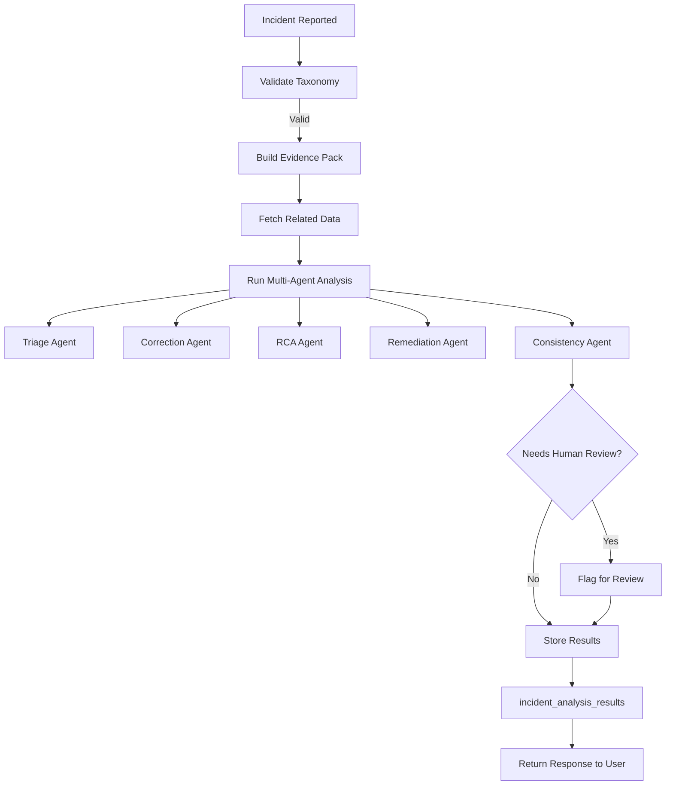

# Proposal Drafter Database Schema


## Overview

The Proposal Drafter application is designed to streamline the process of creating, reviewing, and managing project proposals for humanitarian and development organizations. This database schema supports a comprehensive workflow from proposal creation through peer review and knowledge management.


```mermaid

erDiagram
    teams {
        UUID id PK
        string name UK
    }

    users {
        UUID id PK
        string email UK
        string password
        string name
        UUID team_id FK
        JSONB security_questions
        boolean session_active
        timestamptz created_at
        timestamptz updated_at
        string geographic_coverage_type
        string geographic_coverage_region
        string geographic_coverage_country
        INTEGER requested_role_id FK
    }

    roles {
        INTEGER id PK
        string name UK
    }

    user_roles {
        UUID user_id FK
        INTEGER role_id FK
    }

    user_role_requests {
        UUID user_id FK
        INTEGER role_id FK
    }

    user_donor_groups {
        UUID user_id FK
        string donor_group FK
    }

    user_donors {
        UUID user_id FK
        UUID donor_id FK
    }

    user_outcomes {
        UUID user_id FK
        UUID outcome_id FK
    }

    user_field_contexts {
        UUID user_id FK
        UUID field_context_id FK
    }

    donors {
        UUID id PK
        string account_id UK
        string name UK
        string country
        string donor_group
        UUID created_by FK
        timestamptz created_at
        timestamptz last_updated
    }

    outcomes {
        UUID id PK
        string name UK
        UUID created_by FK
        timestamptz created_at
        timestamptz last_updated
    }

    field_contexts {
        UUID id PK
        string title
        string name UK
        string category
        string geographic_coverage
        string unhcr_region
        UUID created_by FK
        timestamptz created_at
        timestamptz last_updated
    }

    proposals {
        UUID id PK
        UUID user_id FK
        string template_name
        JSONB form_data
        text project_description
        JSONB generated_sections
        JSONB reviews
        boolean is_accepted
        proposal_status status
        string contribution_id
        UUID created_by FK
        timestamptz created_at
        UUID updated_by FK
        timestamptz updated_at
        UUID template_registry_id FK
        UUID template_version_id FK
    }

    proposal_status_history {
        UUID id PK
        UUID proposal_id FK
        proposal_status status
        JSONB generated_sections_snapshot
        timestamptz created_at
    }

    proposal_peer_reviews {
        UUID id PK
        UUID proposal_id FK
        UUID reviewer_id FK
        UUID proposal_status_history_id FK
        string section_name
        string rating
        string status
        timestamptz deadline
        text review_text
        text author_response
        string type_of_comment
        string severity
        timestamptz created_at
        timestamptz updated_at
    }

    knowledge_cards {
        UUID id PK
        string template_name
        string type
        text summary
        JSONB generated_sections
        boolean is_accepted
        proposal_status status
        UUID donor_id FK
        UUID outcome_id FK
        UUID field_context_id FK
        UUID created_by FK
        timestamptz created_at
        UUID updated_by FK
        timestamptz updated_at
        UUID template_registry_id FK
        UUID template_version_id FK
    }

    knowledge_card_history {
        UUID id PK
        UUID knowledge_card_id FK
        JSONB generated_sections_snapshot
        UUID created_by FK
        timestamptz created_at
    }

    knowledge_card_reviews {
        UUID id PK
        UUID knowledge_card_id FK
        UUID reviewer_id FK
        string section_name
        string rating
        text review_text
        text author_response
        string type_of_comment
        string severity
        string status
        timestamptz created_at
        timestamptz updated_at
    }

    knowledge_card_references {
        UUID id PK
        string url UK
        string reference_type
        text summary
        UUID created_by FK
        timestamptz created_at
        UUID updated_by FK
        timestamptz updated_at
        timestamptz scraped_at
        boolean scraping_error
    }

    knowledge_card_to_references {
        UUID knowledge_card_id FK
        UUID reference_id FK
    }

    knowledge_card_reference_vectors {
        UUID id PK
        UUID reference_id FK
        text text_chunk
        vector embedding
    }

    knowledge_card_usage {
        UUID id PK
        UUID knowledge_card_id FK
        UUID user_id FK
        string action
        UUID proposal_id FK
        timestamptz created_at
    }

    knowledge_card_reference_errors {
        UUID id PK
        UUID reference_id FK
        string error_type
        text error_message
        timestamptz created_at
    }

    incident_analysis_results {
        UUID id PK
        string artifact_type
        string source_review_id FK
        UUID proposal_id FK
        UUID knowledge_card_id FK
        UUID template_request_id FK
        string incident_type
        string severity
        string status
        JSONB analysis_payload
        timestamptz created_at
        timestamptz updated_at
    }

    rag_evaluation_logs {
        UUID id PK
        UUID knowledge_card_id FK
        text query
        JSONB retrieved_context
        text generated_answer
        timestamptz created_at
    }

    donor_template_comments {
        UUID id PK
        UUID template_request_id FK
        string template_name
        UUID user_id FK
        text comment_text
        string section_name
        string rating
        string severity
        string type_of_comment
        string author_response
        string status
        timestamptz created_at
    }

    donor_template_requests {
        UUID id PK
        string name
        UUID donor_id FK
        UUID[] donor_ids
        string template_type
        JSONB configuration
        JSONB initial_file_content
        string status
        UUID created_by FK
        timestamptz created_at
        timestamptz updated_at
    }

    template_registry {
        UUID id PK
        string template_key UK
        string template_name
        string template_type
        UUID source_template_request_id FK
        UUID owner_user_id FK
        UUID owning_team_id FK
        text description
        boolean active
        timestamptz created_at
        timestamptz updated_at
    }

    template_versions {
        UUID id PK
        UUID template_registry_id FK
        string version_label
        INTEGER version_number
        string environment
        string status
        JSONB configuration
        JSONB template_content
        JSONB initial_file_content
        text release_notes
        UUID cloned_from_version_id FK
        UUID created_by FK
        timestamptz created_at
        UUID updated_by FK
        timestamptz updated_at
        timestamptz promoted_at
        UUID promoted_by FK
        timestamptz suspended_at
        UUID suspended_by FK
    }

    qualification_rule_sets {
        UUID id PK
        string name UK
        string template_type
        string version_label
        boolean is_active
        text description
        UUID created_by FK
        timestamptz created_at
        UUID updated_by FK
        timestamptz updated_at
    }

    qualification_rules {
        UUID id PK
        UUID rule_set_id FK
        string rule_code
        string rule_name
        string category
        string severity
        string applies_to
        string evaluation_mode
        string metric_name
        string comparator
        NUMERIC threshold_numeric
        JSONB threshold_json
        NUMERIC weight
        boolean required
        text description
        text remediation_guidance
        boolean is_active
        timestamptz created_at
    }

    qualification_scenarios {
        UUID id PK
        string scenario_code UK
        string template_type
        string name
        text description
        UUID donor_id FK
        UUID outcome_id FK
        UUID field_context_id FK
        JSONB geography
        JSONB metadata
        boolean active
        UUID created_by FK
        timestamptz created_at
    }

    template_qualification_runs {
        UUID id PK
        UUID template_version_id FK
        UUID rule_set_id FK
        string run_name
        string environment
        string status
        INTEGER target_sample_size
        INTEGER actual_sample_size
        INTEGER required_reviewer_count
        timestamptz started_at
        timestamptz completed_at
        NUMERIC overall_score
        string decision
        text decision_reason
        UUID initiated_by FK
        UUID approved_by FK
        timestamptz created_at
        timestamptz updated_at
    }

    template_qualification_run_scenarios {
        UUID id PK
        UUID qualification_run_id FK
        UUID scenario_id FK
        boolean is_required
        boolean executed
        text notes
    }

    qualification_evidence_items {
        UUID id PK
        UUID qualification_run_id FK
        string source_artifact_type
        UUID source_id
        string source_table
        UUID proposal_id FK
        UUID knowledge_card_id FK
        UUID template_request_id FK
        UUID scenario_id FK
        string section_name
        string severity
        string incident_type
        string rating
        JSONB evidence_payload
        timestamptz created_at
    }

    qualification_rule_evaluations {
        UUID id PK
        UUID qualification_run_id FK
        UUID rule_id FK
        string result
        NUMERIC metric_value
        JSONB metric_payload
        text explanation
        UUID waived_by FK
        text waiver_reason
        timestamptz created_at
    }

    template_qualification_signoffs {
        UUID id PK
        UUID qualification_run_id FK
        UUID reviewer_id FK
        string role_name
        string decision
        text comments
        timestamptz signed_at
    }

    template_release_history {
        UUID id PK
        UUID template_version_id FK
        UUID qualification_run_id FK
        string action
        string from_environment
        string to_environment
        string previous_status
        string new_status
        text reason
        UUID actioned_by FK
        timestamptz created_at
    }

    qualification_waivers {
        UUID id PK
        UUID qualification_run_id FK
        UUID rule_id FK
        UUID approved_by FK
        text reason
        timestamptz expires_at
        timestamptz created_at
    }

    proposal_donors {
        UUID proposal_id FK
        UUID donor_id FK
    }

    proposal_outcomes {
        UUID proposal_id FK
        UUID outcome_id FK
    }

    proposal_field_contexts {
        UUID proposal_id FK
        UUID field_context_id FK
    }

    users ||--o{ teams : belongs_to
    users ||--o{ roles : "has many through user_roles"
    users ||--o{ donors : creates
    users ||--o{ outcomes : creates
    users ||--o{ field_contexts : creates
    users ||--o{ proposals : creates
    users ||--o{ proposals : updates
    users ||--o{ knowledge_cards : creates
    users ||--o{ knowledge_cards : updates
    users ||--o{ knowledge_card_history : creates
    users ||--o{ knowledge_card_references : creates
    users ||--o{ knowledge_card_references : updates
    users ||--o{ knowledge_card_reviews : reviews
    users ||--o{ proposal_peer_reviews : reviews
    users ||--o{ donor_template_comments : creates
    users ||--o{ template_registry : owns
    users ||--o{ template_versions : creates
    users ||--o{ qualification_rule_sets : creates
    users ||--o{ qualification_scenarios : creates
    users ||--o{ template_qualification_runs : initiates
    users ||--o{ template_qualification_signoffs : signs
    users ||--o{ template_release_history : actions
    users ||--o{ qualification_waivers : approves

    roles ||--o{ user_roles : "has many"
    roles ||--o{ user_role_requests : "has many"
    user_roles }|--|| users : "belongs to"
    user_roles }|--|| roles : "belongs to"
    user_role_requests }|--|| users : "belongs to"
    user_role_requests }|--|| roles : "belongs to"

    users ||--o{ user_donor_groups : "has many"
    users ||--o{ user_donors : "has many"
    users ||--o{ user_outcomes : "has many"
    users ||--o{ user_field_contexts : "has many"
    user_donor_groups }|--|| users : "belongs to"
    user_donors }|--|| users : "belongs to"
    user_donors }|--|| donors : "belongs to"
    user_outcomes }|--|| users : "belongs to"
    user_outcomes }|--|| outcomes : "belongs to"
    user_field_contexts }|--|| users : "belongs to"
    user_field_contexts }|--|| field_contexts : "belongs to"

    proposals ||--o{ proposal_status_history : has
    proposals ||--o{ proposal_peer_reviews : has
    proposals }o--o{ donors : "has many through proposal_donors"
    proposals }o--o{ outcomes : "has many through proposal_outcomes"
    proposals }o--o{ field_contexts : "has many through proposal_field_contexts"
    proposals }|--|| template_registry : "uses"
    proposals }|--|| template_versions : "uses"

    knowledge_cards ||--o{ knowledge_card_history : has
    knowledge_cards ||--o{ knowledge_card_reviews : has
    knowledge_cards ||--o{ knowledge_card_references : "has many through knowledge_card_to_references"
    knowledge_card_references ||--o{ knowledge_card_reference_vectors : has
    knowledge_card_references ||--o{ knowledge_card_reference_errors : has
    knowledge_card_references ||--o{ knowledge_card_to_references : "has many"
    knowledge_card_to_references }|--|| knowledge_cards : "belongs to"
    knowledge_card_to_references }|--|| knowledge_card_references : "belongs to"
    knowledge_cards ||--o{ knowledge_card_usage : has
    knowledge_cards ||--o{ rag_evaluation_logs : has
    knowledge_cards }|--|| template_registry : "uses"
    knowledge_cards }|--|| template_versions : "uses"

    knowledge_cards }|--|| donors : "optional link to"
    knowledge_cards }|--|| outcomes : "optional link to"
    knowledge_cards }|--|| field_contexts : "optional link to"

    proposal_status_history ||--o{ proposal_peer_reviews : references

    incident_analysis_results }|--|| proposals : "optional link to"
    incident_analysis_results }|--|| knowledge_cards : "optional link to"
    incident_analysis_results }|--|| donor_template_requests : "optional link to"

    donor_template_requests ||--o{ donor_template_comments : has
    donor_template_requests }|--|| donors : "optional link to"

    template_registry ||--o{ template_versions : has
    template_registry }|--|| users : "owned by"
    template_registry }|--|| teams : "optional team"

    template_versions ||--o{ template_qualification_runs : has
    template_versions }|--|| template_versions : "cloned from"

    qualification_rule_sets ||--o{ qualification_rules : has

    qualification_scenarios }|--|| donors : "optional link to"
    qualification_scenarios }|--|| outcomes : "optional link to"
    qualification_scenarios }|--|| field_contexts : "optional link to"

    template_qualification_runs ||--o{ template_qualification_run_scenarios : has
    template_qualification_runs ||--o{ qualification_evidence_items : has
    template_qualification_runs ||--o{ qualification_rule_evaluations : has
    template_qualification_runs ||--o{ template_qualification_signoffs : has
    template_qualification_runs ||--o{ template_release_history : has
    template_qualification_runs ||--o{ qualification_waivers : has
    template_qualification_runs }|--|| qualification_rule_sets : "uses"

    template_qualification_run_scenarios }|--|| template_qualification_runs : "belongs to"
    template_qualification_run_scenarios }|--|| qualification_scenarios : "belongs to"

    qualification_evidence_items }|--|| template_qualification_runs : "belongs to"
    qualification_evidence_items }|--|| proposals : "optional link to"
    qualification_evidence_items }|--|| knowledge_cards : "optional link to"
    qualification_evidence_items }|--|| donor_template_requests : "optional link to"
    qualification_evidence_items }|--|| qualification_scenarios : "optional link to"

    qualification_rule_evaluations }|--|| template_qualification_runs : "belongs to"
    qualification_rule_evaluations }|--|| qualification_rules : "belongs to"
    qualification_rule_evaluations }|--|| users : "optional waived by"

    template_qualification_signoffs }|--|| template_qualification_runs : "belongs to"
    template_qualification_signoffs }|--|| users : "signed by"

    template_release_history }|--|| template_versions : "belongs to"
    template_release_history }|--|| template_qualification_runs : "optional link to"
    template_release_history }|--|| users : "actioned by"

    qualification_waivers }|--|| template_qualification_runs : "belongs to"
    qualification_waivers }|--|| qualification_rules : "belongs to"
    qualification_waivers }|--|| users : "approved by"

    proposals ||--o{ proposal_donors : "has many"
    donors ||--o{ proposal_donors : "has many"
    proposal_donors }|--|| proposals : "belongs to"
    proposal_donors }|--|| donors : "belongs to"

    proposals ||--o{ proposal_outcomes : "has many"
    outcomes ||--o{ proposal_outcomes : "has many"
    proposal_outcomes }|--|| proposals : "belongs to"
    proposal_outcomes }|--|| outcomes : "belongs to"

    proposals ||--o{ proposal_field_contexts : "has many"
    field_contexts ||--o{ proposal_field_contexts : "has many"
    proposal_field_contexts }|--|| proposals : "belongs to"
    proposal_field_contexts }|--|| field_contexts : "belongs to"
```

## Core Entities

### Users & Teams

 * Users represent individual team members with authentication credentials and security questions

 * Teams group users together for organizational purposes

 * Each user belongs to one team, supporting collaborative work environments

 * Users can have multiple roles through the user_roles join table

 * Role requests are managed through user_role_requests for approval workflows

 * Users can be associated with donor groups, specific donors, outcomes, and field contexts for personalized content recommendations

## Proposal Management

### Proposals

The central entity representing project proposals with:

 * Form data stored as JSON for flexible field structures

 * Generated sections containing AI-generated content

 * Status tracking through an enum type (draft, in_review, pre_submission, submitted, deleted, generating_sections, failed)

 * Review system with peer feedback mechanisms

 * Version control through status history snapshots

 * Template registry and versioning support for standardized proposal structures

## Proposal Relationships

Proposals can be linked to multiple:

 * Donors - funding organizations

 * Outcomes - desired results or impact areas

 * Field Contexts - geographical and thematic focus areas

These many-to-many relationships are managed through join tables (proposal_donors, proposal_outcomes, proposal_field_contexts).

## Knowledge Management

### Knowledge Cards

Reusable content components that serve as a knowledge base:

 * Can be linked to one of: Donor, Outcome, or Field Context (enforced by constraint)

 * Store generated content sections for reuse across proposals

 * Maintain version history through snapshots

 * Support reference management with web scraping capabilities

 * Track usage patterns through knowledge_card_usage table

 * Support peer review workflows through knowledge_card_reviews

### Knowledge Card References

 * Store external references and resources

 * Support vector embeddings for semantic search (knowledge_card_reference_vectors)

 * Include scraping status and error tracking

 * Enable AI-powered content recommendations

 * Track reference errors through knowledge_card_reference_errors

 * Many-to-many relationship with knowledge cards through knowledge_card_to_references join table

## Workflow Support

### Peer Review System

 * Proposal Peer Reviews allow multiple reviewers to provide feedback

 * Section-specific comments with severity ratings

 * Author response tracking

 * Deadline management for review cycles

 * Knowledge Card Reviews extend peer review to knowledge management

### Status Tracking

 * Proposal Status History maintains complete audit trails

 * Snapshots of generated sections at each status change

 * Supports rollback and version comparison

## Template Management System

### Template Registry

 * Centralized template management through template_registry table

 * Supports both proposal and knowledge card templates

 * Version control through template_versions with environment tracking (UAT/PROD)

 * Template cloning and evolution through cloned_from_version_id

 * Ownership and team management for collaborative template development

### Template Qualification Workflow

 * Quality assurance through qualification_rule_sets and qualification_rules

 * Scenario-based testing with qualification_scenarios

 * Comprehensive qualification runs tracked in template_qualification_runs

 * Evidence collection through qualification_evidence_items

 * Rule evaluation and compliance tracking via qualification_rule_evaluations

 * Multi-stakeholder signoff process with template_qualification_signoffs

 * Release management and promotion history in template_release_history

 * Waiver system for exceptions through qualification_waivers

## Incident Management System

### Incident Analysis Results

The `incident_analysis_results` table stores comprehensive analysis of quality issues and incidents:

 * **Artifact Types**: proposal, knowledge_card, template

 * **Severity Levels**: P0 (Critical), P1 (High), P2 (Medium), P3 (Low)

 * **Incident Types**: Taxonomy-based classification (Factual Error, Compliance Violation, etc.)

 * **Analysis Payload**: Complete JSON analysis including root cause, suggestions, and remediation

 * **Status Tracking**: Analysis lifecycle management

### RAG Evaluation Logs

The `rag_evaluation_logs` table captures retrieval-augmented generation interactions:

 * **Query Tracking**: Original user queries

 * **Retrieved Context**: Source documents and references used

 * **Generated Answers**: AI-produced responses

 * **Knowledge Card Link**: Association with specific knowledge cards

### Template Management

The `donor_template_requests` and `donor_template_comments` tables support template-based workflows:

 * **Template Requests**: Donor-specific template configurations

 * **Template Comments**: Review and feedback on templates

 * **Version Control**: Template evolution tracking

 * **Configuration Management**: Flexible template structures

## Technical Features

### Data Types & Extensions
=======
## Core Entities

### Users & Teams

 * Users represent individual team members with authentication credentials and security questions

 * Teams group users together for organizational purposes

 * Each user belongs to one team, supporting collaborative work environments

 * Users can have multiple roles through the user_roles join table

 * Role requests are managed through user_role_requests for approval workflows

 * Users can be associated with donor groups, specific donors, outcomes, and field contexts for personalized content recommendations

## Proposal Management

### Proposals

The central entity representing project proposals with:

 * Form data stored as JSON for flexible field structures

 * Generated sections containing AI-generated content

 * Status tracking through an enum type (draft, in_review, pre_submission, submitted, deleted, generating_sections, failed)

 * Review system with peer feedback mechanisms

 * Version control through status history snapshots

 * Template registry and versioning support for standardized proposal structures

## Proposal Relationships

Proposals can be linked to multiple:

 * Donors - funding organizations

 * Outcomes - desired results or impact areas

 * Field Contexts - geographical and thematic focus areas

These many-to-many relationships are managed through join tables (proposal_donors, proposal_outcomes, proposal_field_contexts).

## Knowledge Management

### Knowledge Cards

Reusable content components that serve as a knowledge base:

 * Can be linked to one of: Donor, Outcome, or Field Context (enforced by constraint)

 * Store generated content sections for reuse across proposals

 * Maintain version history through snapshots

 * Support reference management with web scraping capabilities

 * Track usage patterns through knowledge_card_usage table

 * Support peer review workflows through knowledge_card_reviews

### Knowledge Card References

 * Store external references and resources

 * Support vector embeddings for semantic search (knowledge_card_reference_vectors)

 * Include scraping status and error tracking

 * Enable AI-powered content recommendations

 * Track reference errors through knowledge_card_reference_errors

 * Many-to-many relationship with knowledge cards through knowledge_card_to_references join table

## Workflow Support

### Peer Review System

 * Proposal Peer Reviews allow multiple reviewers to provide feedback

 * Section-specific comments with severity ratings

 * Author response tracking

 * Deadline management for review cycles

 * Knowledge Card Reviews extend peer review to knowledge management

### Status Tracking

 * Proposal Status History maintains complete audit trails

 * Snapshots of generated sections at each status change

 * Supports rollback and version comparison

## Template Management System

### Template Registry

 * Centralized template management through template_registry table

 * Supports both proposal and knowledge card templates

 * Version control through template_versions with environment tracking (UAT/PROD)

 * Template cloning and evolution through cloned_from_version_id

 * Ownership and team management for collaborative template development

### Template Qualification Workflow

 * Quality assurance through qualification_rule_sets and qualification_rules

 * Scenario-based testing with qualification_scenarios

 * Comprehensive qualification runs tracked in template_qualification_runs

 * Evidence collection through qualification_evidence_items

 * Rule evaluation and compliance tracking via qualification_rule_evaluations

 * Multi-stakeholder signoff process with template_qualification_signoffs

 * Release management and promotion history in template_release_history

 * Waiver system for exceptions through qualification_waivers

## Incident Management System

### Incident Analysis Results

The `incident_analysis_results` table stores comprehensive analysis of quality issues and incidents:

 * **Artifact Types**: proposal, knowledge_card, template

 * **Severity Levels**: P0 (Critical), P1 (High), P2 (Medium), P3 (Low)

 * **Incident Types**: Taxonomy-based classification (Factual Error, Compliance Violation, etc.)

 * **Analysis Payload**: Complete JSON analysis including root cause, suggestions, and remediation

 * **Status Tracking**: Analysis lifecycle management

### RAG Evaluation Logs

The `rag_evaluation_logs` table captures retrieval-augmented generation interactions:

 * **Query Tracking**: Original user queries

 * **Retrieved Context**: Source documents and references used

 * **Generated Answers**: AI-produced responses

 * **Knowledge Card Link**: Association with specific knowledge cards

### Template Management

The `donor_template_requests` and `donor_template_comments` tables support template-based workflows:

 * **Template Requests**: Donor-specific template configurations

 * **Template Comments**: Review and feedback on templates

 * **Version Control**: Template evolution tracking

 * **Configuration Management**: Flexible template structures

## Technical Features

### Data Types & Extensions

 * Vector extension for AI-powered semantic search (1536-dimensional embeddings)

 * JSONB for flexible schema-less data storage

 * UUID primary keys for distributed system compatibility

 * Enum types for controlled status values (proposal_status, release_environment, managed_template_type, etc.)

### Constraints & Validation

 * Unique constraints prevent duplicate entities

 * Check constraints ensure data integrity (e.g., knowledge card linking rules, artifact type validation)

 * Foreign key constraints maintain referential integrity with appropriate cascade behaviors

 * Timestamp tracking for audit purposes with automated triggers

 * Complex validation rules for template qualification workflows

## Key Relationships

### One-to-Many

 * Team → Users

 * User → Created entities (proposals, knowledge cards, etc.)

 * Proposal → Status History entries

 * Knowledge Card → Reference entries

 * Knowledge Card → Usage tracking

 * Knowledge Card → Reviews

 * Template Registry → Template Versions

 * Qualification Run → Evidence Items, Rule Evaluations, Signoffs

### Many-to-Many

 * Proposals ↔ Donors (through proposal_donors)

 * Proposals ↔ Outcomes (through proposal_outcomes)

 * Proposals ↔ Field Contexts (through proposal_field_contexts)

 * Users ↔ Roles (through user_roles)

 * Users ↔ Donor Groups (through user_donor_groups)

 * Users ↔ Specific Donors (through user_donors)

 * Users ↔ Outcomes (through user_outcomes)

 * Users ↔ Field Contexts (through user_field_contexts)

 * Knowledge Cards ↔ References (through knowledge_card_to_references)

 * Qualification Runs ↔ Scenarios (through template_qualification_run_scenarios)

### Optional Links

 * Knowledge Cards can optionally link to one related entity (donor, outcome, or field context)

 * Proposals can optionally link to template registry and versions

 * Incident analysis can link to proposals, knowledge cards, or template requests

## Indexing Strategy

The schema includes strategic indexes on:

 * User email for authentication

 * Foreign key columns for join performance

 * Proposal and knowledge card relationships

 * Review and status tracking tables

 * Template registry and version lookups

 * Qualification run and rule evaluation indexes

 * Full-text and vector search optimization

## Incident Management System

### Incident Analysis Results

The `incident_analysis_results` table stores comprehensive analysis of quality issues and incidents:

 * **Artifact Types**: proposal, knowledge_card, template
 * **Severity Levels**: P0 (Critical), P1 (High), P2 (Medium), P3 (Low)
 * **Incident Types**: Taxonomy-based classification (Factual Error, Compliance Violation, etc.)
 * **Analysis Payload**: Complete JSON analysis including root cause, suggestions, and remediation
 * **Status Tracking**: Analysis lifecycle management

### RAG Evaluation Logs

The `rag_evaluation_logs` table captures retrieval-augmented generation interactions:

 * **Query Tracking**: Original user queries
 * **Retrieved Context**: Source documents and references used
 * **Generated Answers**: AI-produced responses
 * **Knowledge Card Link**: Association with specific knowledge cards

### Template Management

The `donor_template_requests` and `donor_template_comments` tables support template-based workflows:

 * **Template Requests**: Donor-specific template configurations
 * **Template Comments**: Review and feedback on templates
 * **Version Control**: Template evolution tracking
 * **Configuration Management**: Flexible template structures

## Incident Analysis Workflow



### Key Relationships

 * **Incident Analysis → Proposals**: Links analysis to specific proposals
 * **Incident Analysis → Knowledge Cards**: Links analysis to knowledge cards
 * **Incident Analysis → Template Requests**: Links analysis to templates
 * **Knowledge Cards → RAG Logs**: Tracks retrieval operations
 * **Template Requests → Comments**: Manages template feedback

## Security Considerations

 * User authentication with password hashing

 * Security questions for account recovery

 * Session management tracking

 * Audit trails for all major operations

 * Role-based access control through user_roles system

 * Team-based resource ownership and permissions

## Template Qualification Features

### Quality Assurance Framework

 * **Rule Sets**: Organized collections of qualification rules by template type

 * **Individual Rules**: Configurable validation rules with severity levels and evaluation modes

 * **Scenarios**: Test scenarios with donor/outcome/field context associations

 * **Qualification Runs**: Complete workflow tracking from evidence collection to final decision

### Governance and Compliance

 * **Multi-Stakeholder Signoff**: Role-based approval process

 * **Waiver System**: Exception management with expiration

 * **Release History**: Complete audit trail of template promotions and status changes

 * **Metric Views**: Pre-computed quality metrics for proposal and knowledge card templates

### Continuous Improvement

 * **Evidence-Based Decision Making**: Structured evidence collection and analysis

 * **Rule Evaluation Tracking**: Detailed compliance reporting

 * **Performance Metrics**: Quality KPIs and trend analysis

 * **Version Comparison**: Support for template evolution analysis

### Integration Points

 * **Proposal Workflow**: Template version tracking on proposals

 * **Knowledge Management**: Template version tracking on knowledge cards

 * **Incident Management**: Quality issue linkage to qualification evidence

 * **User Feedback**: Template comment integration with qualification process

This schema supports a comprehensive, enterprise-grade proposal drafting system with advanced template management, quality assurance, and incident analysis capabilities while maintaining data integrity, audit trails, and performance optimization.