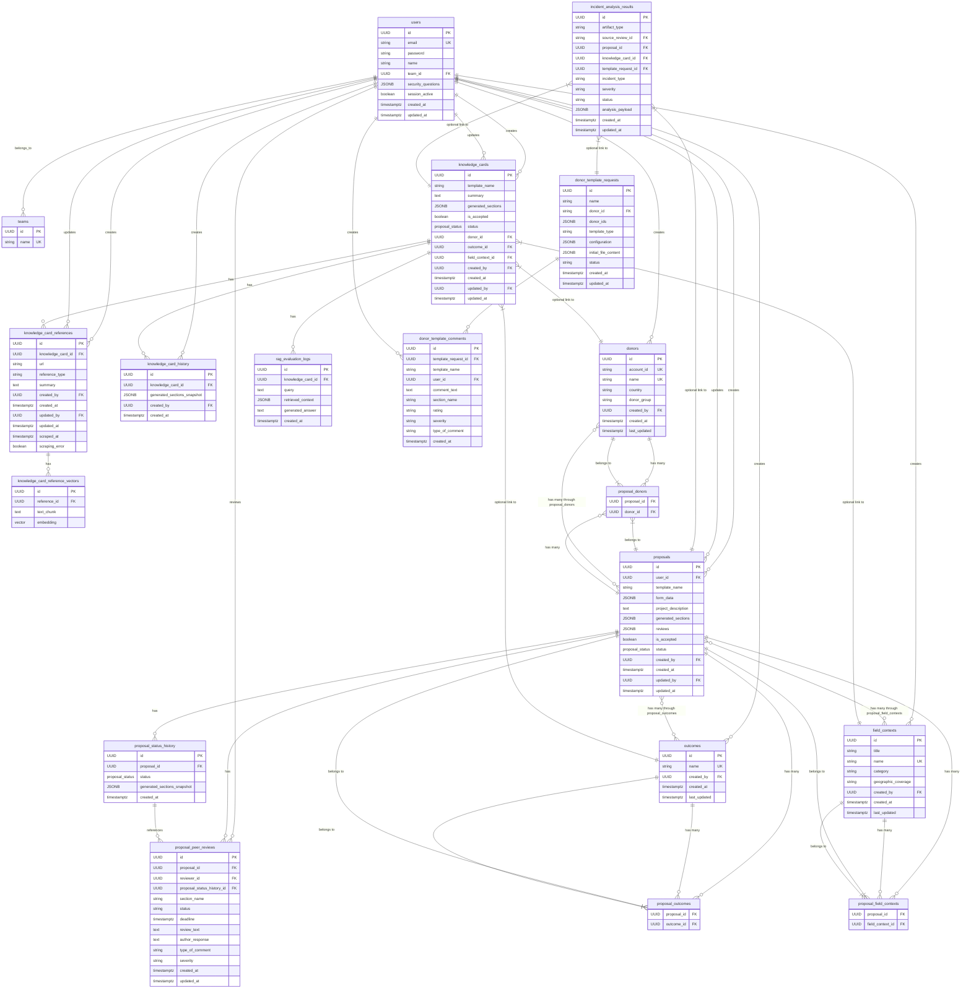
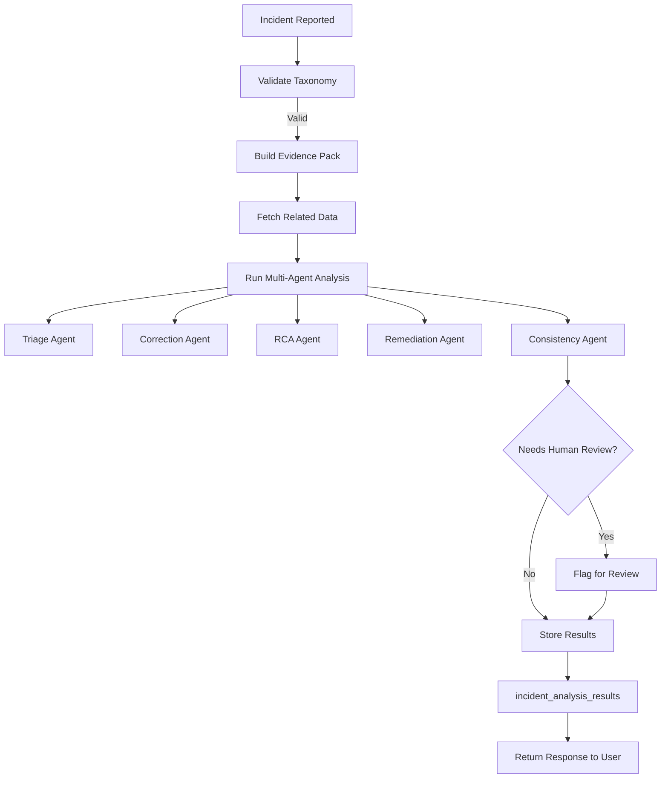

# Proposal Drafter Database Schema

## Overview

The Proposal Drafter application is designed to streamline the process of creating, reviewing, and managing project proposals for humanitarian and development organizations. This database schema supports a comprehensive workflow from proposal creation through peer review and knowledge management.

## Core Entities

### Users & Teams

 * Users represent individual team members with authentication credentials and security questions

 * Teams group users together for organizational purposes

 * Each user belongs to one team, supporting collaborative work environments

## Proposal Management

### Proposals

The central entity representing project proposals with:

 * Form data stored as JSON for flexible field structures

 * Generated sections containing AI-generated content

 * Status tracking through an enum type (draft, in_review, submission, submitted, approved, deleted, generating_sections, failed)

 * Review system with peer feedback mechanisms

 * Version control through status history snapshots

## Proposal Relationships

Proposals can be linked to multiple:

 * Donors - funding organizations

 * Outcomes - desired results or impact areas

 * Field Contexts - geographical and thematic focus areas

These many-to-many relationships are managed through join tables (proposal_donors, proposal_outcomes, proposal_field_contexts).

## Knowledge Management

### Knowledge Cards

Reusable content components that serve as a knowledge base:

 * Can be linked to one of: Donor, Outcome, or Field Context (enforced by constraint)

 * Store generated content sections for reuse across proposals

 * Maintain version history through snapshots

 * Support reference management with web scraping capabilities

### Knowledge Card References

 * Store external references and resources

 * Support vector embeddings for semantic search (knowledge_card_reference_vectors)

 * Include scraping status and error tracking

 * Enable AI-powered content recommendations

## Workflow Support

### Peer Review System

 * Proposal Peer Reviews allow multiple reviewers to provide feedback

 * Section-specific comments with severity ratings

 * Author response tracking

 * Deadline management for review cycles

### Status Tracking

 * Proposal Status History maintains complete audit trails

 * Snapshots of generated sections at each status change

 * Supports rollback and version comparison

## Technical Features

### Data Types & Extensions

 * Vector extension for AI-powered semantic search (1536-dimensional embeddings)

 * JSONB for flexible schema-less data storage

 * UUID primary keys for distributed system compatibility

 * Enum types for controlled status values

### Constraints & Validation

 * Unique constraints prevent duplicate entities

 * Check constraints ensure data integrity (e.g., knowledge card linking rules)

 * Foreign key constraints maintain referential integrity

 * Timestamp tracking for audit purposes

## Key Relationships

### One-to-Many

 * Team → Users

 * User → Created entities (proposals, knowledge cards, etc.)

 * Proposal → Status History entries

 * Knowledge Card → Reference entries

### Many-to-Many

 * Proposals ↔ Donors (through proposal_donors)

 * Proposals ↔ Outcomes (through proposal_outcomes)

 * Proposals ↔ Field Contexts (through proposal_field_contexts)

### Optional Links

 * Knowledge Cards can optionally link to one related entity (donor, outcome, or field context)

## Indexing Strategy

The schema includes strategic indexes on:

 * User email for authentication

 * Foreign key columns for join performance

 * Proposal and knowledge card relationships

 * Review and status tracking tables

## Incident Management System

### Incident Analysis Results

The `incident_analysis_results` table stores comprehensive analysis of quality issues and incidents:

 * **Artifact Types**: proposal, knowledge_card, template
 * **Severity Levels**: P0 (Critical), P1 (High), P2 (Medium), P3 (Low)
 * **Incident Types**: Taxonomy-based classification (Factual Error, Compliance Violation, etc.)
 * **Analysis Payload**: Complete JSON analysis including root cause, suggestions, and remediation
 * **Status Tracking**: Analysis lifecycle management

### RAG Evaluation Logs

The `rag_evaluation_logs` table captures retrieval-augmented generation interactions:

 * **Query Tracking**: Original user queries
 * **Retrieved Context**: Source documents and references used
 * **Generated Answers**: AI-produced responses
 * **Knowledge Card Link**: Association with specific knowledge cards

### Template Management

The `donor_template_requests` and `donor_template_comments` tables support template-based workflows:

 * **Template Requests**: Donor-specific template configurations
 * **Template Comments**: Review and feedback on templates
 * **Version Control**: Template evolution tracking
 * **Configuration Management**: Flexible template structures

## Incident Analysis Workflow

### Key Relationships

 * **Incident Analysis → Proposals**: Links analysis to specific proposals
 * **Incident Analysis → Knowledge Cards**: Links analysis to knowledge cards
 * **Incident Analysis → Template Requests**: Links analysis to templates
 * **Knowledge Cards → RAG Logs**: Tracks retrieval operations
 * **Template Requests → Comments**: Manages template feedback

## Security Considerations

 * User authentication with password hashing

 * Security questions for account recovery

 * Session management tracking

 * Audit trails for all major operations

## Incident Management Features

### Quality Assurance
 * Automated incident detection and classification
 * Multi-agent AI analysis with specialized roles
 * Root cause analysis with confidence scoring
 * Evidence-based recommendations

### Continuous Improvement
 * Incident trend tracking
 * Systemic issue identification
 * Remediation task management
 * Performance metrics and KPIs

### Integration Points
 * Proposal peer review system
 * Knowledge card validation
 * Template quality control
 * User feedback mechanisms

This schema supports a collaborative, AI-enhanced proposal drafting workflow while maintaining data integrity, audit capabilities, and performance optimization for enterprise-scale operations.