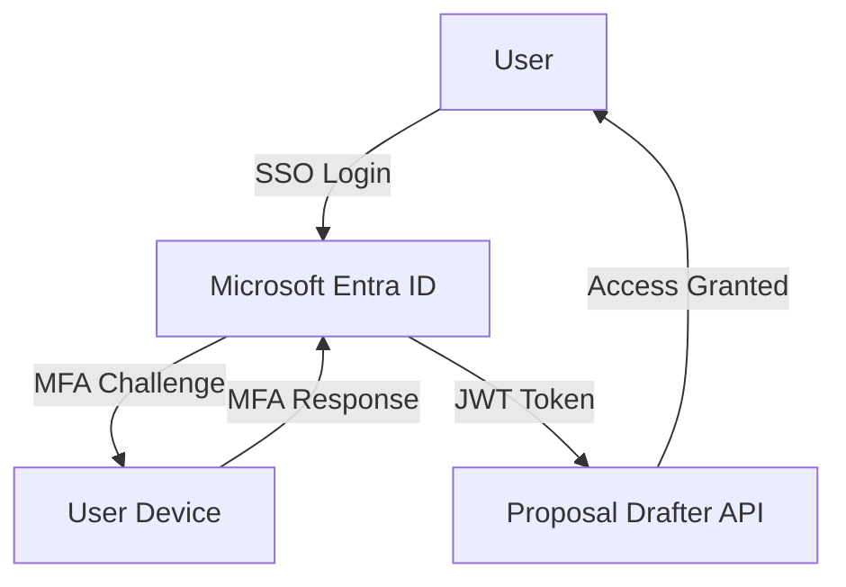
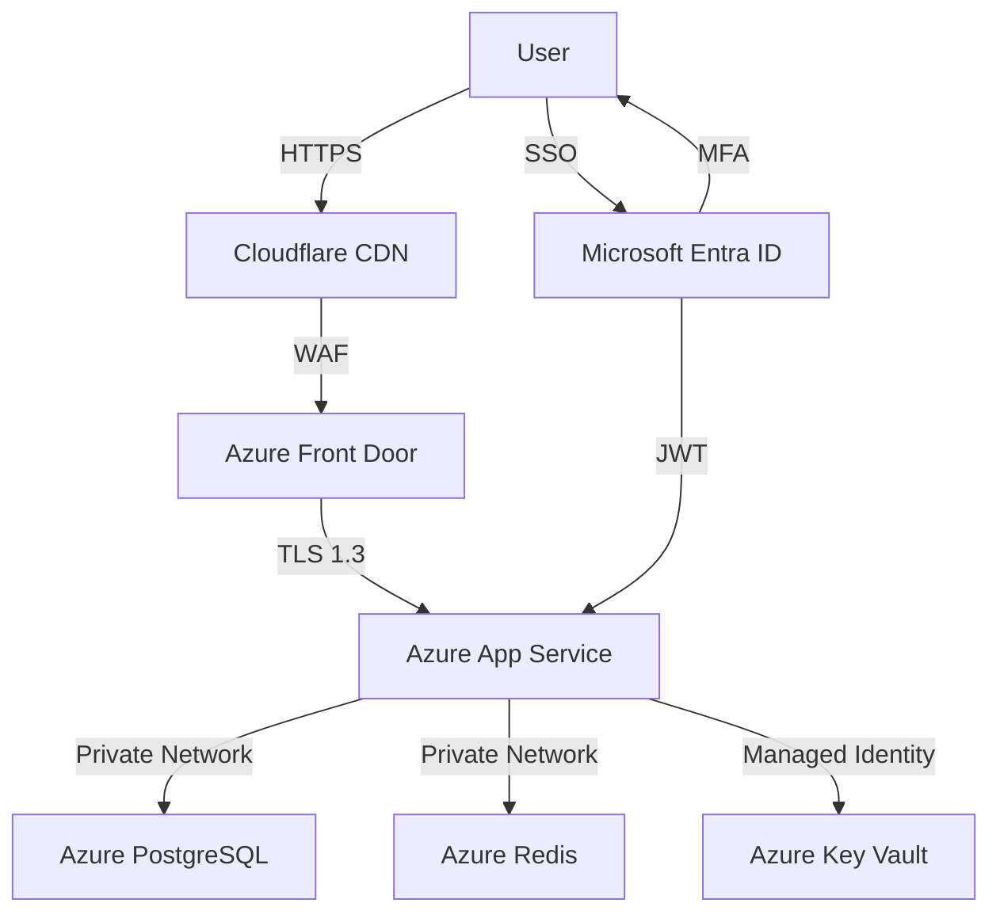

# Proposal Drafter Security Overview

The Proposal Drafter application implements a comprehensive, enterprise-grade security framework. The solution aligns with key compliance frameworks, including [ICT Security Policy](https://unhcr365.sharepoint.com/sites/IntranetSupportServices/SitePages/ict-operations/ict-services/Main-cybersecurity/CybersecurityAdviceStandardsAndGuidelines.aspx), [ISO 27001 controls](https://www.iso.org/isoiec-27001-information-security.html), and [OWASP](https://owasp.org/www-project-top-ten/) risk mitigation strategies. It also takes into account [NIST Cybersecurity Framework](https://www.nist.gov/cyberframework)

Its security posture is built on layered controls spanning authentication, authorization, data protection, monitoring, and incident response, ensuring a high level of protection across the entire system lifecycle.

## Authentication

At the authentication level, the application relies primarily on Single Sign-On (SSO) integrated with Microsoft Entra ID, which automatically enforces multi-factor authentication (MFA). This inherited MFA approach eliminates the need for separate configuration while leveraging enterprise-grade identity controls, including conditional access and risk-based authentication. Access is secured using JSON Web Tokens (JWTs) with short expiration times (1 hour) and refresh tokens (24 hours), stored securely in HTTP-only cookies. Token revocation is immediate in case of logout or detected security events, reducing the risk of session abuse.

In production, the application is deployed behind standard security measures, including Cloudflare CDN and Azure Front Door.

## Authorization & Access Control

Authorization is managed through a combination of Role-Based Access Control (RBAC) and Attribute-Based Access Control (ABAC). RBAC defines a clear hierarchy of roles—guest, user, editor, admin, and superadmin—with progressively increasing privileges across proposals, templates, users, and audit functions. ABAC enhances this by enforcing context-aware restrictions such as geographic limits, donor group visibility, and field-specific access. Together, these models ensure precise and flexible permission management aligned with the principle of least privilege.

| Role | Proposals | Users | Templates | Admin | Audit |
|------|-----------|-------|----------|-------|-------|
| user | CRUD | Read | Read | - | - |
| editor | CRUD | Read | CRUD | - | - |
| superadmin | CRUD | CRUD | CRUD | CRUD | CRUD |

## Data Protection

Data protection is enforced through strong encryption both in transit and at rest. Transport Layer Security ( secures all communications using modern cipher suites and perfect forward secrecy. At rest, data is encrypted using PostgreSQL-native mechanisms and managed securely through Azure Key Vault for secrets and keys. This ensures confidentiality and integrity of sensitive data throughout its lifecycle.

The application also incorporates robust network and API security controls. APIs are protected through rate limiting, CORS policies, CSRF protections, and strong security headers, reducing exposure to common web-based attacks.

The application leverages SQLAlchemy ORM (Object-Relational Mapping) to prevent SQL injection vulnerabilities. Instead of constructing raw SQL queries, all database interactions are performed through parameterized queries generated by the ORM, which automatically separates user input from executable SQL code.

From an application security perspective, the system employs rigorous input validation, output sanitization, and secure coding practices. Technologies like FastAPI, Pydantic, React validation libraries, and tools such as DOMPurify are used to prevent injection attacks and cross-site scripting. The design emphasizes fail-secure defaults, minimal privilege usage, and safe error handling.

## Monitoring & Logging

Monitoring and logging are integral components of the security strategy. The system logs authentication events, access patterns, administrative actions, and system changes. These logs are integrated into a Security Information and Event Management (SIEM) system for real-time threat detection, anomaly analysis, and automated incident response. Retention policies ensure long-term auditability and compliance.

In addition, the application includes a well-defined incident response framework with clear classification levels, response timelines, and structured procedures for detection, containment, recovery, and post-incident analysis. Privacy is embedded through “privacy by design” principles, emphasizing data minimization, user rights, and regulatory compliance.
