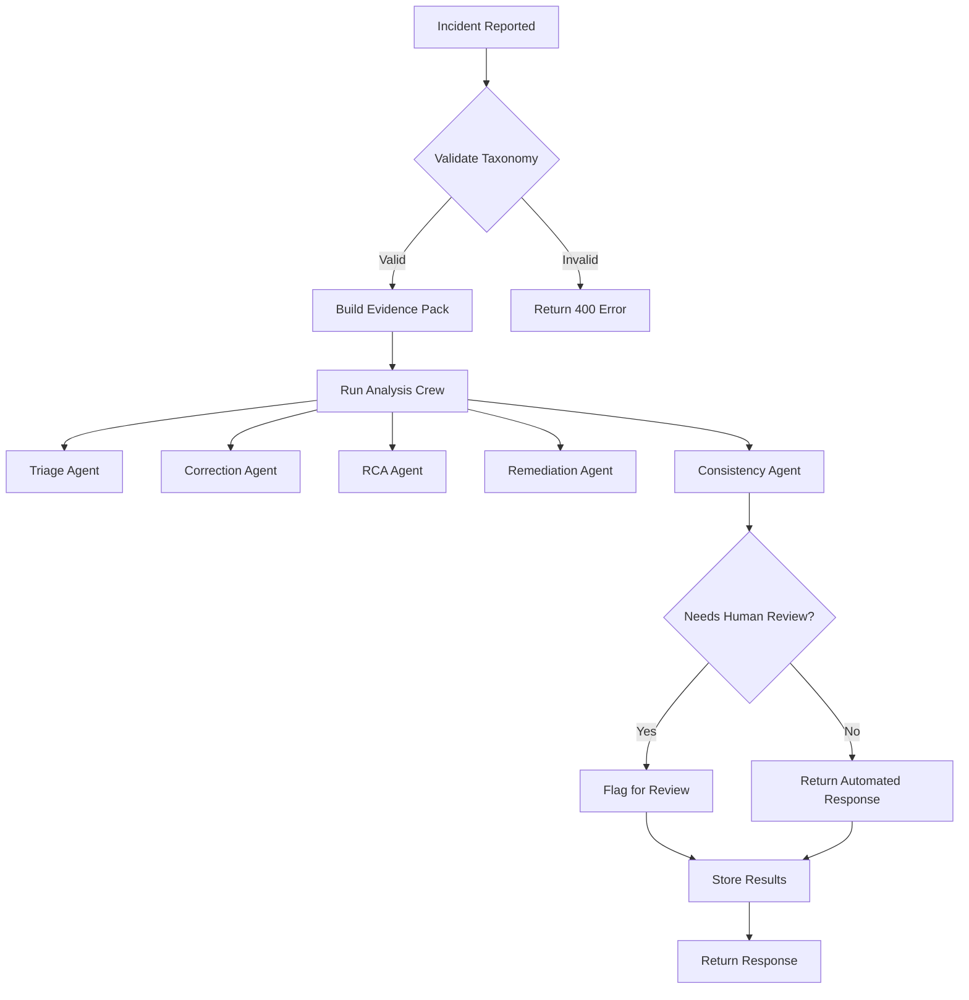

# Incident Management System - Quick Start Guide

## Getting Started

### Installation

1. **Install dependencies:**
```bash
cd backend
pip install -r requirements.txt
```

2. **Set up environment variables:**
```env
# Add to your .env file
REDIS_URL=redis://localhost:6379/0
DB_HOST=your-database-host
DB_NAME=proposalgen
DB_USERNAME=your-username
DB_PASSWORD=your-password
LLM_MODEL=gpt-4
PERSIST_ANALYSIS_RESULTS=True
```

3. **Start Redis (for rate limiting):**
```bash
docker run -p 6379:6379 redis
```

## Basic Usage

### Analyze a Manual Incident

```python
import requests

response = requests.post(
    "http://localhost:8000/api/incidents/analyze",
    json={
        "artifact_type": "proposal",
        "severity": "P1", 
        "incident_type": "Major Content Gap",
        "proposal_id": "prop-123",
        "section_name": "budget",
        "user_comment": "Missing critical budget line items for refugee support"
    },
    headers={"Authorization": "Bearer your-access-token"}
)

analysis = response.json()
print(f"Incident ID: {analysis['incident_id']}")
print(f"Root Cause: {analysis['root_cause_analysis']['primary_cause']}")
print(f"Suggested Fix: {analysis['user_suggestion']['proposed_action']}")
```

### Analyze from Existing Review

```python
# For proposal reviews
response = requests.post(
    "http://localhost:8000/api/incidents/analyze/proposal-review/rev-456",
    headers={"Authorization": "Bearer your-access-token"}
)

# For knowledge card reviews
response = requests.post(
    "http://localhost:8000/api/incidents/analyze/knowledge-card-review/kc-rev-789",
    headers={"Authorization": "Bearer your-access-token"}
)

# For template reviews
response = requests.post(
    "http://localhost:8000/api/incidents/analyze/template-review/tmpl-rev-101",
    headers={"Authorization": "Bearer your-access-token"}
)
```

### Retrieve Analysis Results

```python
response = requests.get(
    "http://localhost:8000/api/incidents/result/analysis-123",
    headers={"Authorization": "Bearer your-access-token"}
)

result = response.json()
print(f"Status: {result['status']}")
print(f"Needs human review: {result['needs_human_review']}")
```

## Common Incident Types

### Proposal Incidents

| Severity | Type | When to Use |
|----------|------|-------------|
| P0 | Factual Error | Incorrect data that could cause compliance issues |
| P0 | Compliance Violation | Violates donor or organizational requirements |
| P1 | Major Content Gap | Missing critical sections or information |
| P1 | Structural Issue | Poor organization affecting readability |
| P2 | Clarity Issue | Ambiguous or confusing language |
| P3 | Formatting Issue | Minor layout or style problems |

### Knowledge Card Incidents

| Severity | Type | When to Use |
|----------|------|-------------|
| P0 | Data Integrity | Corrupted or unreliable source data |
| P0 | Source Error | References to non-existent sources |
| P1 | Metadata Issue | Incorrect categorization or tagging |
| P1 | Outdated Information | Source data no longer current |
| P2 | Relevance Issue | Content not relevant to the context |
| P3 | Formatting Issue | Minor presentation problems |

### Template Incidents

| Severity | Type | When to Use |
|----------|------|-------------|
| P0 | Compliance Issue | Template violates regulatory requirements |
| P0 | Structural Problem | Template has fundamental design flaws |
| P1 | Major Quality Issue | Significant quality concerns |
| P1 | Content Gap | Missing required template sections |
| P2 | Clarity Issue | Template instructions are unclear |
| P3 | Formatting Issue | Minor template formatting problems |

## Understanding the Response

### Key Fields

```json
{
  "incident_id": "unique-identifier",
  "artifact_type": "proposal",
  "severity": "P1",
  "incident_type": "Major Content Gap",
  "status": "analyzed",
  "needs_human_review": true,
  "human_review_reason": "High severity incident requires human review",
  "user_suggestion": {
    "summary": "Add missing budget details",
    "proposed_action": "Include line items for refugee support programs",
    "confidence": 0.85
  },
  "root_cause_analysis": {
    "primary_cause": "template_mapping_failure",
    "explanation": "The budget section template doesn't include all required line items",
    "confidence": 0.92
  },
  "suggested_system_fix": {
    "category": "template_design",
    "priority": "high",
    "recommendation": "Update budget template to include all required line items",
    "implementation_tasks": [
      {
        "description": "Update budget template",
        "owner": "template-team",
        "eta_days": 7
      }
    ]
  }
}
```

### Decision Flow



## Best Practices

### When to Use This System

✅ **Use for:**
- Quality assurance of generated proposals
- Knowledge card validation
- Template improvement
- Compliance checking
- Continuous improvement

❌ **Don't use for:**
- Real-time user feedback (use direct editing instead)
- Non-content issues (use bug tracking system)
- Performance monitoring (use metrics system)

### Effective Incident Reporting

1. **Be specific** about the problem location (section_name)
2. **Provide context** in user_comment
3. **Choose the right severity** based on impact
4. **Select the most accurate incident_type**
5. **Include related IDs** for better evidence building

### Handling Results

1. **Review high-severity (P0/P1) incidents immediately**
2. **Check confidence scores** - lower scores may need verification
3. **Follow root cause analysis** for systemic improvements
4. **Implement suggested system fixes** to prevent recurrence
5. **Monitor consistency checks** for quality assurance

## Rate Limits

To prevent abuse, the following rate limits apply:

- **Analysis endpoints**: 10 requests per minute per user
- **Result retrieval**: 30 requests per minute per user

If you hit rate limits:
- Implement client-side caching
- Batch similar requests
- Contact administrators if you need higher limits

## Error Handling

### Common Errors and Solutions

**Error: "incident_type X is not valid for Y/Z"**
- Check the taxonomy in the documentation
- Use one of the allowed types for that artifact_type + severity

**Error: "429 Too Many Requests"**
- Wait and retry
- Implement exponential backoff
- Reduce request frequency

**Error: "404 Not Found"**
- Verify the review_id exists
- Check your permissions
- Confirm the artifact type matches the review

**Error: "500 Internal Server Error"**
- Check server logs
- Verify database connectivity
- Report to administrators with details

## Integration Examples

### Python Client

```python
import requests
from typing import Dict, Any

class IncidentClient:
    def __init__(self, base_url: str, api_key: str):
        self.base_url = base_url.rstrip('/')
        self.headers = {
            'Authorization': f'Bearer {api_key}',
            'Content-Type': 'application/json'
        }
    
    def analyze_incident(self, incident_data: Dict[str, Any]) -> Dict[str, Any]:
        """Analyze a new incident"""
        response = requests.post(
            f"{self.base_url}/api/incidents/analyze",
            json=incident_data,
            headers=self.headers
        )
        response.raise_for_status()
        return response.json()
    
    def analyze_proposal_review(self, review_id: str) -> Dict[str, Any]:
        """Analyze from existing proposal review"""
        response = requests.post(
            f"{self.base_url}/api/incidents/analyze/proposal-review/{review_id}",
            headers=self.headers
        )
        response.raise_for_status()
        return response.json()
    
    def get_analysis_result(self, analysis_id: str) -> Dict[str, Any]:
        """Retrieve analysis results"""
        response = requests.get(
            f"{self.base_url}/api/incidents/result/{analysis_id}",
            headers=self.headers
        )
        response.raise_for_status()
        return response.json()

# Usage
client = IncidentClient("http://localhost:8000", "your-api-key")
result = client.analyze_incident({
    "artifact_type": "proposal",
    "severity": "P2",
    "incident_type": "Clarity Issue",
    "proposal_id": "prop-123",
    "section_name": "objectives"
})
```

### JavaScript Client

```javascript
class IncidentClient {
    constructor(baseUrl, apiKey) {
        this.baseUrl = baseUrl.replace(/\/$/, '');
        this.headers = {
            'Authorization': `Bearer ${apiKey}`,
            'Content-Type': 'application/json'
        };
    }
    
    async analyzeIncident(incidentData) {
        const response = await fetch(
            `${this.baseUrl}/api/incidents/analyze`, 
            {
                method: 'POST',
                headers: this.headers,
                body: JSON.stringify(incidentData)
            }
        );
        if (!response.ok) {
            throw new Error(`HTTP error! status: ${response.status}`);
        }
        return response.json();
    }
    
    async analyzeProposalReview(reviewId) {
        const response = await fetch(
            `${this.baseUrl}/api/incidents/analyze/proposal-review/${reviewId}`, 
            {
                method: 'POST',
                headers: this.headers
            }
        );
        if (!response.ok) {
            throw new Error(`HTTP error! status: ${response.status}`);
        }
        return response.json();
    }
}

// Usage
const client = new IncidentClient('http://localhost:8000', 'your-api-key');
const result = await client.analyzeIncident({
    artifact_type: 'knowledge_card',
    severity: 'P1',
    incident_type: 'Metadata Issue',
    knowledge_card_id: 'kc-456'
});
```

## Monitoring and Maintenance

### Health Checks

```bash
# Check if incident endpoints are available
curl -X GET "http://localhost:8000/api/incidents/result/invalid-id" \
     -H "Authorization: Bearer your-token"

# Should return 404 with proper error format
```

### Log Monitoring

Key log patterns to watch:
- `"Error fetching proposal review"` - Database issues
- `"Error saving incident analysis"` - Persistence problems
- `"Rate limit exceeded"` - Potential abuse
- `"Incident analysis failed"` - Processing errors

### Performance Tuning

1. **Adjust rate limits** based on usage patterns
2. **Optimize database queries** for evidence building
3. **Tune LLM parameters** for faster analysis
4. **Cache frequent incident types**
5. **Monitor agent performance** and adjust prompts

## Troubleshooting Checklist

1. ✅ **Check environment variables** are set correctly
2. ✅ **Verify Redis is running** for rate limiting
3. ✅ **Confirm database connectivity**
4. ✅ **Validate API authentication**
5. ✅ **Review incident taxonomy** for valid types
6. ✅ **Check rate limit headers** in responses
7. ✅ **Examine server logs** for detailed errors
8. ✅ **Test with simple cases** first
9. ✅ **Verify input data format** matches schemas
10. ✅ **Check for network issues** between services

## Support Resources

- **Full Documentation**: See `docs/incident-management.md`
- **API Reference**: Swagger/OpenAPI docs at `/docs`
- **Source Code**: `backend/api/incident.py` and related files
- **Configuration**: Environment variables and `settings.py`

## Quick Reference

### Endpoints

```
POST  /api/incidents/analyze                      # Manual analysis
POST  /api/incidents/analyze/proposal-review/{id}  # From proposal review
POST  /api/incidents/analyze/knowledge-card-review/{id}  # From KC review
POST  /api/incidents/analyze/template-review/{id}  # From template review
GET   /api/incidents/result/{id}                  # Get results
```

### Severity Levels

- **P0**: Critical - Immediate attention required
- **P1**: High - Important but not urgent
- **P2**: Medium - Should be addressed
- **P3**: Low - Nice to have

### Common Root Causes

- `grounding_failure` - LLM not properly grounded in data
- `retrieval_failure` - Failed to retrieve relevant information
- `template_mapping_failure` - Template structure issues
- `prompt_instruction_failure` - Prompt engineering problems
- `post_processing_failure` - Output formatting issues

## Glossary

- **Artifact**: A proposal, knowledge card, or template
- **Evidence Pack**: Collection of data used for analysis
- **RCA**: Root Cause Analysis
- **P0-P3**: Severity levels (P0 = most severe)
- **Taxonomy**: Classification system for incident types
- **Agent**: AI component performing specific analysis tasks