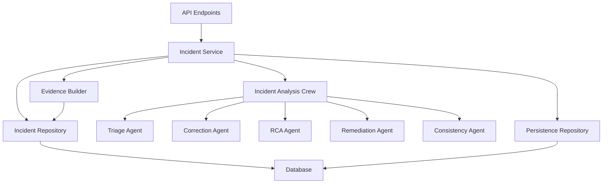

# Incident Management System

## Overview

The Incident Management System is a comprehensive framework for analyzing, triaging, and resolving incidents related to proposal generation, knowledge cards, and templates. It uses a multi-agent AI approach to provide automated analysis, root cause identification, and remediation recommendations.

## Architecture



## Core Components

### 1. API Endpoints

Location: `backend/api/incident.py`

The system exposes several RESTful endpoints:

#### POST `/api/incidents/analyze`
Analyzes a manually provided incident.

**Request Body:**
```json
{
  "artifact_type": "proposal",
  "severity": "P1",
  "incident_type": "Major Content Gap",
  "source_review_id": "optional-review-id",
  "proposal_id": "optional-proposal-id",
  "section_name": "optional-section",
  "user_comment": "optional-comment"
}
```

**Response:** `IncidentAnalysisResponse` (see Schemas section)

#### POST `/api/incidents/analyze/proposal-review/{review_id}`
Analyzes an incident based on a proposal review.

**Response:** `IncidentAnalysisResponse`

#### POST `/api/incidents/analyze/knowledge-card-review/{review_id}`
Analyzes an incident based on a knowledge card review.

**Response:** `IncidentAnalysisResponse`

#### POST `/api/incidents/analyze/template-review/{review_id}`
Analyzes an incident based on a template review.

**Response:** `IncidentAnalysisResponse`

#### GET `/api/incidents/result/{analysis_id}`
Retrieves a previously stored incident analysis result.

**Response:** `IncidentAnalysisResponse`

### 2. Incident Service

Location: `backend/utils/incident_service.py`

The main orchestration layer that:
- Validates input using taxonomy rules
- Builds evidence packs from various sources
- Coordinates the AI analysis crew
- Handles persistence of results
- Manages error handling and logging

**Key Methods:**
- `analyze_incident(request: IncidentAnalyzeRequest) -> IncidentAnalysisResponse`
- `get_persisted_result(analysis_id: str) -> IncidentAnalysisResponse`

### 3. Evidence Builder

Location: `backend/utils/evidence_builder.py`

Constructs comprehensive evidence packs by gathering data from:
- Proposal reviews and history
- Knowledge card reviews, references, and RAG logs
- Template reviews and configuration
- Related metadata and context

**Methods:**
- `build_from_request(request) -> dict` - Main entry point
- `_build_proposal_evidence(review_id) -> dict` - Proposal-specific evidence
- `_build_knowledge_card_evidence(review_id) -> dict` - Knowledge card evidence
- `_build_template_evidence(review_id) -> dict` - Template evidence

### 4. Incident Analysis Crew

Location: `backend/utils/crew_incident_analysis.py`

A multi-agent system using CrewAI framework:

**Agents:**
1. **Triage Agent** - Classifies and prioritizes incidents
2. **Correction Agent** - Suggests immediate fixes
3. **RCA Agent** - Performs root cause analysis
4. **Remediation Agent** - Recommends system improvements
5. **Consistency Agent** - Ensures output coherence

**Method:**
- `analyze(incident: dict, evidence_pack: dict) -> dict` - Runs full analysis pipeline

### 5. Repository Layer

#### Incident Repository
Location: `backend/utils/incident_repository.py`

Provides database access for:
- Fetching reviews (proposals, knowledge cards, templates)
- Retrieving historical data and context
- Gathering related evidence

#### Persistence Repository
Location: `backend/utils/persistence_repository.py`

Handles storage and retrieval of:
- Incident analysis results
- Metadata and payloads
- Status tracking

## Data Models & Schemas

### Enums

#### ArtifactType
```python
class ArtifactType(str, Enum):
    proposal = "proposal"
    knowledge_card = "knowledge_card"
    template = "template"
```

#### Severity
```python
class Severity(str, Enum):
    P0 = "P0"  # Critical
    P1 = "P1"  # High
    P2 = "P2"  # Medium
    P3 = "P3"  # Low
```

### Request Schema

#### IncidentAnalyzeRequest
```python
class IncidentAnalyzeRequest(BaseModel):
    artifact_type: ArtifactType
    severity: Severity
    incident_type: str  # Must be valid for artifact_type + severity
    source_review_id: str | None = None
    proposal_id: str | None = None
    knowledge_card_id: str | None = None
    template_request_id: str | None = None
    section_name: str | None = None
    user_comment: str | None = None
    generator_run_id: str | None = None
    related_requirement_ids: list[str] = []
    related_knowledge_card_ids: list[str] = []
```

### Response Schema

#### IncidentAnalysisResponse
```python
class IncidentAnalysisResponse(BaseModel):
    incident_id: str
    artifact_type: ArtifactType
    severity: Severity
    incident_type: str
    status: str
    source_review_id: str | None = None
    proposal_id: str | None = None
    knowledge_card_id: str | None = None
    template_request_id: str | None = None
    section_name: str | None = None
    user_comment: str | None = None
    normalized_summary: str | None = None
    evidence: dict[str, Any] = {}
    user_suggestion: UserSuggestion
    root_cause_analysis: RootCauseAnalysis
    suggested_system_fix: SuggestedSystemFix
    consistency_check: ConsistencyCheck = ConsistencyCheck()
    needs_human_review: bool
    human_review_reason: str | None = None
    routing: dict[str, Any] = {}
    agent_versions: dict[str, str] = {}
    created_at: str
    updated_at: str | None = None
```

### Supporting Schemas

#### UserSuggestion
Provides actionable recommendations for immediate fixes.

#### RootCauseAnalysis
Identifies primary, secondary, immediate, and systemic causes with confidence scores.

#### SuggestedSystemFix
Recommends durable system improvements with implementation details.

#### ConsistencyCheck
Validates that all outputs are mutually consistent and evidence-grounded.

## Validation & Taxonomy

### Type of Comment Options

The system enforces a strict taxonomy of incident types based on artifact type and severity:

**Proposal Incidents:**
- P0: Factual Error, Compliance Violation, Security Risk
- P1: Major Content Gap, Structural Issue, Quality Concern
- P2: Clarity Issue, Tone Mismatch, Minor Gap
- P3: Formatting Issue, Typo, Style Suggestion

**Knowledge Card Incidents:**
- P0: Data Integrity, Source Error, Critical Omission
- P1: Metadata Issue, Duplicate Content, Outdated Information
- P2: Relevance Issue, Traceability Gap, Generic Content
- P3: Formatting Issue, Minor Error, Style Suggestion

**Template Incidents:**
- P0: Compliance Issue, Structural Problem, Critical Error
- P1: Major Quality Issue, Content Gap, Format Problem
- P2: Clarity Issue, Tone Mismatch, Minor Improvement
- P3: Formatting Issue, Typo, Style Suggestion

### Root Cause Priors

Each incident type has predefined likely root causes to guide analysis:

```python
ROOT_CAUSE_PRIORS = {
    "proposal": {
        "Factual Error": ["grounding_failure", "outdated_knowledge", "retrieval_failure"],
        # ... other mappings
    },
    # knowledge_card and template mappings
}
```

## Security Features

### Rate Limiting

All endpoints are protected with rate limiting:
- Analysis endpoints: 10 requests per minute
- Result retrieval: 30 requests per minute

Implemented using `fastapi-limiter` with Redis backend.

### Input Validation

- All inputs validated using Pydantic models
- Taxonomy enforcement via `validate_taxonomy()` function
- SQL parameterization for all database queries
- Proper error handling and logging

### Authentication & Authorization

- Inherits from main API authentication system
- Uses `get_current_user` dependency for protected endpoints
- Role-based access control via `check_user_group_access`

## Error Handling

### Common Error Responses

**400 Bad Request**
```json
{
  "detail": "incident_type 'Invalid Type' is not valid for proposal/P0. Allowed: ['Factual Error', 'Compliance Violation', 'Security Risk']"
}
```

**404 Not Found**
```json
{
  "detail": "Proposal review not found."
}
```

**500 Internal Server Error**
```json
{
  "detail": "Incident analysis failed: [error details]"
}
```

### Logging

Comprehensive logging at all levels:
- Database operations with error details
- Service layer processing
- API endpoint access
- Rate limiting events

## Usage Examples

### Analyzing a Proposal Incident

```python
import requests
import json

# Manual incident analysis
response = requests.post(
    "http://api.example.com/api/incidents/analyze",
    json={
        "artifact_type": "proposal",
        "severity": "P1",
        "incident_type": "Major Content Gap",
        "proposal_id": "prop-123",
        "section_name": "budget",
        "user_comment": "Missing critical budget line items"
    },
    headers={"Authorization": "Bearer your-token"}
)

analysis = response.json()
print(f"Analysis ID: {analysis['incident_id']}")
print(f"Needs human review: {analysis['needs_human_review']}")
print(f"Suggested fix: {analysis['user_suggestion']['proposed_action']}")
```

### Analyzing from Existing Review

```python
# Analyze based on existing proposal review
response = requests.post(
    "http://api.example.com/api/incidents/analyze/proposal-review/rev-456",
    headers={"Authorization": "Bearer your-token"}
)

analysis = response.json()
print(f"Root cause: {analysis['root_cause_analysis']['primary_cause']}")
print(f"System fix: {analysis['suggested_system_fix']['recommendation']}")
```

## Deployment Considerations

### Environment Variables

```env
# Rate limiting
REDIS_URL=redis://redis:6379/0

# Database
DB_HOST=your-db-host
DB_NAME=proposalgen
DB_USERNAME=your-username
DB_PASSWORD=your-password

# AI Configuration
LLM_MODEL=gpt-4
DEBUG=False
PERSIST_ANALYSIS_RESULTS=True
```

### Database Schema

Required tables:
- `incident_analysis_results` - Stores analysis outputs
- `proposal_peer_reviews` - Source for proposal incidents
- `knowledge_card_reviews` - Source for knowledge card incidents
- `donor_template_comments` - Source for template incidents
- Related history and context tables

### Dependencies

```txt
fastapi-limiter
redis
sqlalchemy
crewai
pydantic
```

## Monitoring & Observability

### Key Metrics to Monitor

1. **Incident Volume** - Number of incidents by type and severity
2. **Analysis Time** - Average processing time per incident
3. **Human Review Rate** - Percentage requiring human intervention
4. **Rate Limit Hits** - API abuse detection
5. **Error Rates** - Failed analyses and database errors

### Logging Strategy

- Structured JSON logging for easy parsing
- Correlation IDs for tracing requests
- Error-level logging for failures
- Info-level logging for major operations
- Debug logging for development

## Best Practices

### Incident Analysis

1. **Start with automated analysis** for all incidents
2. **Prioritize P0/P1 incidents** for immediate human review
3. **Use evidence packs** to provide full context to reviewers
4. **Follow root cause analysis** recommendations for systemic fixes
5. **Monitor consistency checks** for quality assurance

### System Maintenance

1. **Regularly update root cause priors** based on new patterns
2. **Review taxonomy mappings** quarterly
3. **Monitor agent performance** and adjust prompts as needed
4. **Clean up old analysis results** periodically
5. **Test rate limiting** configuration under load

## Troubleshooting

### Common Issues

**Issue: "incident_type not valid" error**
- Check the `TYPE_OF_COMMENT_OPTIONS` taxonomy
- Ensure the incident_type matches the artifact_type and severity

**Issue: Rate limit exceeded**
- Implement client-side caching
- Batch requests where possible
- Contact admin to adjust limits if needed

**Issue: Database connection errors**
- Verify environment variables
- Check database availability
- Review connection pooling settings

**Issue: Analysis timeout**
- Check LLM API availability
- Review agent complexity
- Consider simplifying prompts

## Future Enhancements

1. **Incident Trends Dashboard** - Visualize patterns over time
2. **Automated Remediation** - Auto-apply approved fixes
3. **Incident Clustering** - Group similar incidents
4. **Performance Metrics** - Track resolution effectiveness
5. **Integration Webhooks** - Notify external systems
6. **Custom Taxonomy** - Allow per-organization configurations

## API Reference

### Rate Limits

- `POST /analyze*` endpoints: 10 requests per minute
- `GET /result/{id}` endpoint: 30 requests per minute

### Authentication

All endpoints require `Authorization: Bearer <token>` header.

### Response Codes

- `200 OK` - Success
- `400 Bad Request` - Invalid input
- `401 Unauthorized` - Authentication failed
- `403 Forbidden` - Insufficient permissions
- `404 Not Found` - Resource not found
- `429 Too Many Requests` - Rate limit exceeded
- `500 Internal Server Error` - Server-side failure

## Support

For issues with the Incident Management System:

1. Check logs for detailed error information
2. Review the taxonomy and validation rules
3. Verify database connectivity and schema
4. Contact system administrators for rate limit adjustments
5. File bug reports with reproduction steps

## Changelog

### v1.0.0 (Current)
- Initial implementation of incident management system
- Multi-agent analysis crew
- Comprehensive evidence building
- Rate limiting and security features
- Full API documentation

### Future Versions
- v1.1.0: Enhanced dashboard and reporting
- v1.2.0: Automated remediation capabilities
- v1.3.0: Custom taxonomy support
