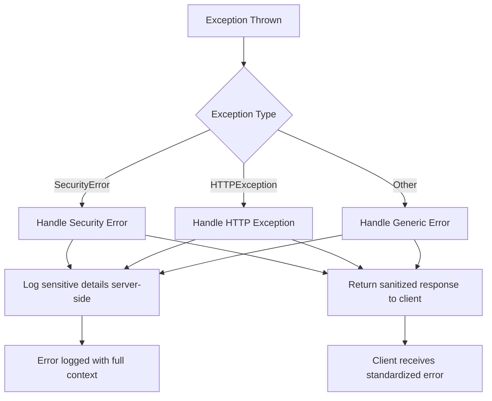

# Interface Contracts: Proposal Drafter

**Version:** 1.0
**Date:** 2025-05-13
**Input:** Feature specification from `/specs/001-proposal_drafter/spec.md`
**Purpose:** Phase 1 - Interface Contracts

---

## Overview

This directory contains the interface contracts for the Proposal Drafter system. These contracts define how the system interacts with external consumers (users, other systems) and internal components.

---

## Contract Types

### 1. API Contracts

**Location:** [contracts/api/](contracts/api/)

**Purpose:** Define the RESTful API endpoints, request/response formats, authentication requirements, and error handling for the backend service.

**Audience:** Frontend developers, API consumers, integration partners

### 2. Frontend-Backend Contract

**Purpose:** Define the communication protocol between the React frontend and FastAPI backend.

**Audience:** Frontend and backend developers

---

## API Contracts

The Proposal Drafter backend exposes a RESTful API with the following characteristics:

### Base URL
```
Production: https://api.proposal-drafter.org/v1
Staging: https://staging-api.proposal-drafter.org/v1
Development: http://localhost:8502
```

### Authentication

All endpoints require authentication unless marked as public.

**Authentication Methods:**
1. **JWT Bearer Token** (Primary)
   - Header: `Authorization: Bearer <token>`
   - Token location: HTTP-only cookie (preferred) or localStorage
   - Expiry: 15 minutes (access token), 7 days (refresh token)

2. **Azure AD OAuth 2.0** (EntraID)
   - Flow: Authorization Code Flow with PKCE
   - Scopes: `openid`, `profile`, `email`

### Request Format

**Headers:**
```
Content-Type: application/json
Accept: application/json
Authorization: Bearer <token> (if required)
X-Request-ID: <uuid> (for tracing)
```

**Body:** JSON payload validated against Pydantic schemas

### Response Format

**Success Response:**
```json
{
  "success": true,
  "data": {...},
  "meta": {
    "timestamp": "2025-05-13T10:00:00Z",
    "request_id": "<uuid>"
  }
}
```

**Error Response:**
```json
{
  "success": false,
  "error": {
    "code": "<error_code>",
    "message": "Human-readable error message",
    "details": {...},
    "timestamp": "2025-05-13T10:00:00Z",
    "request_id": "<uuid>"
  }
}
```

### Error Codes

The Proposal Drafter API implements standardized error handling with comprehensive security measures to prevent information leakage while providing consistent error responses.

#### Standard Error Codes

| Code | HTTP Status | Description | Security Level |
|------|--------------|-------------|----------------|
| `VALIDATION_ERROR` | 400 | Request validation failed | Low |
| `UNAUTHORIZED` | 401 | Authentication required/failed | Medium |
| `FORBIDDEN` | 403 | User lacks required permissions | High |
| `NOT_FOUND` | 404 | Resource not found | Medium |
| `CONFLICT` | 409 | Resource already exists | Low |
| `RATE_LIMITED` | 429 | Too many requests | Medium |
| `INTERNAL_ERROR` | 500 | Internal server error | High |
| `SERVICE_UNAVAILABLE` | 503 | Service temporarily unavailable | Medium |

#### Security-Focused Error Codes (TASK-SEC-003)

The system implements a comprehensive error code system for security and operational transparency:

**Authentication Errors:**
- `AUTH_001`: Invalid credentials
- `AUTH_002`: Token expired
- `AUTH_003`: Token invalid
- `AUTH_004`: Insufficient permissions
- `AUTH_005`: Account locked

**Authorization Errors:**
- `AUTHZ_001`: Access denied
- `AUTHZ_002`: Resource not found
- `AUTHZ_003`: Operation not permitted

**Validation Errors:**
- `VAL_001`: Invalid input
- `VAL_002`: Missing required field
- `VAL_003`: Invalid format

**Rate Limiting Errors:**
- `RATE_001`: Too many requests
- `RATE_002`: Rate limit exceeded

**LLM Errors:**
- `LLM_001`: LLM service unavailable
- `LLM_002`: LLM request failed
- `LLM_003`: LLM rate limit exceeded

**Database Errors:**
- `DB_001`: Database connection failed
- `DB_002`: Database operation failed

**Generic Errors:**
- `GEN_001`: Internal server error
- `GEN_002`: Service unavailable
- `GEN_003`: Bad request

#### Standardized Error Response Format

All error responses follow a consistent JSON structure:

```json
{
  "error": {
    "code": "AUTH_001",
    "message": "Invalid credentials",
    "status_code": 401,
    "timestamp": "2025-05-13T10:00:00Z",
    "request_id": "abc-123-def-456"
  }
}
```

**Security Features:**
- **No sensitive information**: Stack traces, internal paths, and database details are never exposed
- **Consistent messages**: All authentication failures return the same message ("Invalid credentials")
- **Request tracing**: Each error includes a request ID for server-side debugging
- **Timestamps**: ISO 8601 format for correlation

#### Error Handling Implementation

**Server-Side Logging:**
- All errors logged with full details (including sensitive information)
- Log levels: ERROR for security issues, WARNING for client errors, INFO for operational issues
- Log format includes: error code, message, details, path, request ID, timestamp

**Client-Side Exposure:**
- Only sanitized error codes and messages returned to clients
- Sensitive details filtered using regex patterns
- Message length limited to 200 characters

**Error Handling Workflow:**



**Example Error Handling Code:**

```python
# In API endpoints
error_handler = get_error_handler()

try:
    # Operation that may fail
    user = get_user(user_id)
    if not user:
        security_error = error_handler.create_security_error(
            "resource_not_found",
            details=f"User {user_id} not found"
        )
        raise security_error
except SecurityError as e:
    # Automatically handled by registered exception handlers
    raise
except Exception as e:
    # Generic error handling
    security_error = error_handler.create_security_error(
        "llm_unavailable",
        details=f"Operation failed: {str(e)}"
    )
    raise security_error
```

#### Security Best Practices

1. **Consistent Error Messages**: All authentication failures return "Invalid credentials" regardless of actual cause
2. **No Information Leakage**: Never expose internal system details, stack traces, or sensitive data
3. **Comprehensive Logging**: Log all errors server-side with full context for debugging
4. **Standardized Format**: Consistent error structure across all endpoints
5. **Request Tracing**: Unique request IDs for correlation across services
6. **Rate Limiting**: Protect error endpoints from abuse
7. **Input Sanitization**: Filter sensitive patterns from error messages

#### Testing Error Handling

All error scenarios are covered by comprehensive tests:
- Authentication failures
- Authorization failures
- Validation errors
- Rate limiting scenarios
- LLM service failures
- Database errors
- Generic exceptions

**Test Coverage:**
- Unit tests for error handler classes
- Integration tests for error responses
- Security tests for information leakage prevention
- Load tests for error handling under stress

#### Compliance

The error handling system complies with:
- **OWASP A10:2025**: Mishandling of Exceptional Conditions
- **CWE-209**: Information Exposure Through an Error Message
- **CWE-215**: Information Exposure Through Debug Information
- **GDPR**: Data protection and privacy requirements

*Error handling implementation completed as part of TASK-SEC-003: Standardize Secure Error Handling*

### Authorization Requirements

All endpoints implement object-level authorization to prevent Insecure Direct Object Reference (IDOR) vulnerabilities (OWASP A01:2025-Broken Access Control).

**Authorization Levels:**
- **Public**: No authentication required (health checks)
- **Authenticated**: Valid JWT token required
- **Object-level**: User must have access to the specific resource (ownership, team membership, role-based access)
- **Admin only**: System administrator role required

**Authorization by Endpoint Category:**

| Category | Authorization Level | Implementation |
|----------|---------------------|----------------|
| Authentication | Public (login) / Authenticated | JWT token validation |
| Proposals | Object-level | Ownership, team membership, or donor group membership |
| Knowledge Cards | Object-level | Role-based (knowledge manager donors/outcome/field context) |
| Templates | Object-level | Ownership, organization membership, or public status |
| Metrics | Object-level | Filtered by user access rights (user/team/admin scope) |
| SharePoint | Object-level | Same as source artifact (proposal or knowledge card) |
| Incident Analysis | Object-level | Access to source artifact (proposal, KC, or template) |
| Qualification | Authenticated | System-level operation |
| Documents | Object-level | Same as proposal ownership |
| Admin | Admin only | System administrator role required |
| Health | Public | No authentication required |

**Object-Level Authorization Implementation:**
- All resource-access endpoints verify user has permission to access the specific resource
- Authorization failures return HTTP 403 Forbidden (not 404) to avoid information leakage
- Same authorization pattern applied across all modules: proposals.py, knowledge.py, templates.py, metrics.py, sharepoint.py, incident.py

**Example Authorization Flow:**
```
1. User requests: GET /api/proposals/123
2. System extracts user_id from JWT token
3. System calls check_proposal_access(123, current_user)
4. Function verifies: ownership OR team membership OR donor group membership OR admin
5. If verified: Return proposal data
6. If failed: Return 403 Forbidden
```

### Rate Limiting

- **Authenticated Users:** 1000 requests/minute
- **Unauthenticated Users:** 100 requests/minute
- **LLM Endpoints:** 10 requests/minute (configurable per user)

**Headers:**
```
X-RateLimit-Limit: <max requests>
X-RateLimit-Remaining: <remaining requests>
X-RateLimit-Reset: <timestamp>
Retry-After: <seconds> (when limited)
```

---

## API Endpoint Categories

### 1. Authentication Endpoints

See [contracts/api/auth.md](contracts/api/auth.md)

- POST /api/login - User login
- POST /api/logout - User logout
- POST /api/refresh - Token refresh
- GET /api/me - Current user info

### 2. Proposal Endpoints

See [contracts/api/proposals.md](contracts/api/proposals.md)

- GET /api/proposals - List proposals
- POST /api/create-session - Create new proposal session
- POST /api/generate-proposal-sections/{session_id} - Generate all sections
- POST /api/process_section/{session_id} - Generate single section
- POST /api/regenerate_section/{proposal_id} - Regenerate section
- POST /api/update-section-content - Manual section update
- POST /api/save-draft - Save proposal draft
- POST /api/finalize-proposal - Finalize proposal
- GET /api/load-draft/{proposal_id} - Load draft
- GET /api/list-drafts - List user drafts
- GET /api/list-all-proposals - List all proposals
- GET /api/proposals/reviews - List proposals for review

### 3. Knowledge Card Endpoints

See [contracts/api/knowledge.md](contracts/api/knowledge.md)

- GET /api/knowledge-cards - List knowledge cards
- GET /api/knowledge-cards/{card_id} - Get knowledge card
- GET /api/knowledge-cards/{card_id}/history - Get card history
- POST /api/knowledge-cards - Create knowledge card
- PUT /api/knowledge-cards/{card_id} - Update knowledge card
- DELETE /api/knowledge-cards/{card_id} - Delete knowledge card
- POST /api/knowledge-cards/{card_id}/generate - Generate card content
- POST /api/knowledge-cards/{card_id}/ingest-references - Ingest references
- GET /api/knowledge-cards/{card_id}/status - Generation status (SSE)

### 4. Template Endpoints

See [contracts/api/templates.md](contracts/api/templates.md)

- GET /api/templates - List all templates
- GET /api/templates/{template_name} - Get template details
- GET /api/templates/published/{template_name} - Get published template
- GET /api/templates/{template_name}/sections - Get template sections
- GET /api/templates/request - List template requests
- POST /api/templates/request - Create template request
- GET /api/templates/request/{request_id} - Get template request
- PUT /api/templates/request/{request_id}/status - Update status
- POST /api/templates/request/{request_id}/comment - Add comment

### 5. Incident Analysis Endpoints

See [contracts/api/incident.md](contracts/api/incident.md)

- POST /api/incidents/analyze - Analyze incident
- POST /api/incidents/analyze/proposal-review/{review_id} - Analyze proposal review
- POST /api/incidents/analyze/knowledge-card-review/{review_id} - Analyze KC review
- POST /api/incidents/analyze/template-review/{review_id} - Analyze template review
- GET /api/incidents/result/{analysis_id} - Get analysis result
- GET /api/reviews/{review_id}/analysis - Get review analysis

### 6. Qualification Endpoints

See [contracts/api/qualification.md](contracts/api/qualification.md)

- POST /api/qualification/run - Run qualification
- GET /api/qualification/status - Get qualification status

### 7. Document Export Endpoints

See [contracts/api/documents.md](contracts/api/documents.md)

- GET /api/generate-document/{proposal_id} - Generate document
- GET /api/export-pdf/{proposal_id} - Export as PDF
- GET /api/export-excel/{proposal_id} - Export as Excel

### 8. Admin Endpoints

See [contracts/api/admin.md](contracts/api/admin.md)

- GET /api/admin/users - List all users
- POST /api/admin/users - Create user
- PUT /api/admin/users/{user_id} - Update user
- DELETE /api/admin/users/{user_id} - Delete user
- GET /api/admin/metrics - Get system metrics

### 9. Health and Monitoring

- GET / - Health check
- GET /api/health - Detailed health check
- GET /api/metrics - System metrics (if authenticated)

---

## Frontend-Backend Contract

### Communication Protocol

**Transport:** HTTP/HTTPS with JSON payloads

**Client:** Axios (React frontend)

**Base URL Configuration:**
```javascript
// Development
const API_BASE = 'http://localhost:8502';

// Production
const API_BASE = process.env.REACT_APP_API_BASE || 'https://api.proposal-drafter.org/v1';
```

### Request Configuration

```javascript
// Standard request configuration
const api = axios.create({
  baseURL: API_BASE,
  timeout: 30000, // 30 seconds
  headers: {
    'Content-Type': 'application/json',
  },
  withCredentials: true, // For HTTP-only cookies
});

// Request interceptor for authentication
api.interceptors.request.use((config) => {
  const token = getToken(); // From HTTP-only cookie
  if (token) {
    config.headers.Authorization = `Bearer ${token}`;
  }
  return config;
});

// Response interceptor for error handling
api.interceptors.response.use(
  (response) => response.data,
  (error) => {
    // Handle 401 Unauthorized
    if (error.response?.status === 401) {
      // Attempt token refresh or redirect to login
    }
    // Re-throw error
    return Promise.reject(error);
  }
);
```

### Real-time Updates (SSE)

The system uses Server-Sent Events (SSE) for real-time progress updates during long-running operations.

**Endpoints Supporting SSE:**
- GET /api/knowledge-cards/{card_id}/status - Knowledge card generation progress
- GET /api/proposals/{proposal_id}/generation-status - Proposal generation progress

**Client Implementation:**
```javascript
// Connect to SSE endpoint
const eventSource = new EventSource(`${API_BASE}/api/knowledge-cards/${cardId}/status`);

eventSource.onmessage = (event) => {
  const data = JSON.parse(event.data);
  console.log('Progress:', data.progress);
  console.log('Status:', data.status);

  if (data.status === 'completed' || data.status === 'failed') {
    eventSource.close();
    // Handle completion
  }
};

eventSource.onerror = () => {
  eventSource.close();
  // Handle error
};
```

**Event Format:**
```json
{
  "type": "progress",
  "progress": 45,
  "status": "generating",
  "section": "Executive Summary",
  "timestamp": "2025-05-13T10:00:00Z"
}
```

### File Upload/Download

**Document Upload:**
```javascript
const formData = new FormData();
formData.append('file', file);
formData.append('reference_type', 'pdf');

const response = await api.post('/api/knowledge-cards/references/upload', formData, {
  headers: {
    'Content-Type': 'multipart/form-data',
  },
});
```

**Document Download:**
```javascript
const response = await api.get('/api/export-pdf/123', {
  responseType: 'blob',
});

const url = window.URL.createObjectURL(new Blob([response]));
const link = document.createElement('a');
link.href = url;
link.setAttribute('download', 'proposal.pdf');
document.body.appendChild(link);
link.click();
```

---

## Versioning

### API Versioning

**Strategy:** URL path versioning

**Current Version:** v1

**Future Versions:** /v2/, /v3/, etc.

**Deprecation Policy:**
- 6 months notice before deprecation
- Deprecated endpoints marked in documentation
- Sunset headers in responses

### Contract Versioning

These contract documents follow semantic versioning:
- **Major:** Breaking changes to contracts
- **Minor:** Backward-compatible additions
- **Patch:** Clarifications and corrections

---

## Compliance

### Security

- All endpoints use HTTPS (TLS 1.2+)
- Sensitive data encrypted at rest and in transit
- Input validation on all endpoints
- Output encoding to prevent XSS
- CSRF protection via SameSite cookie attribute

### Privacy

- PII (Personally Identifiable Information) minimized in logs
- User data protected according to GDPR and UN data protection policies
- Audit logs track access to sensitive data

---

## Testing

### Contract Testing

All API endpoints have corresponding tests in the Playwright test suite:
- [playwright/tests/api/](playwright/tests/api/)

### OpenAPI/Swagger

The API is documented using OpenAPI 3.0:
- Auto-generated from FastAPI route definitions
- Available at `/docs` (Swagger UI) and `/redoc` (ReDoc)

---

*Generated by `/speckit.architecture-guard.governed-plan` workflow - Phase 1 Contracts*
