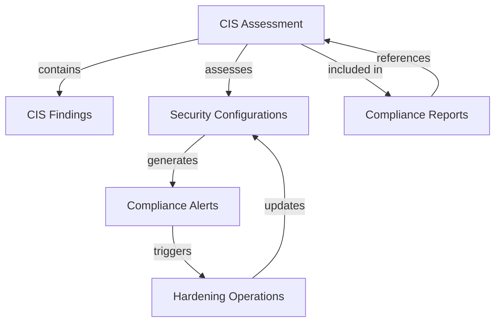
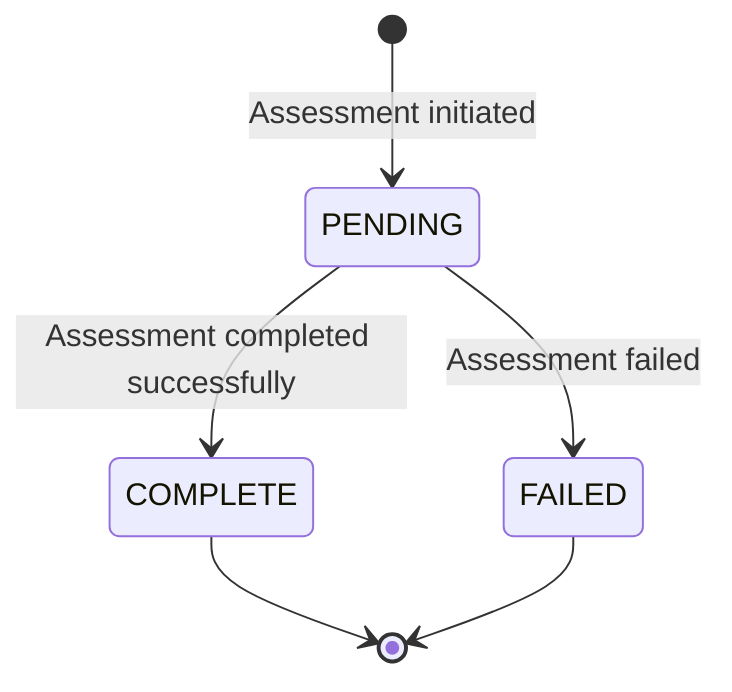
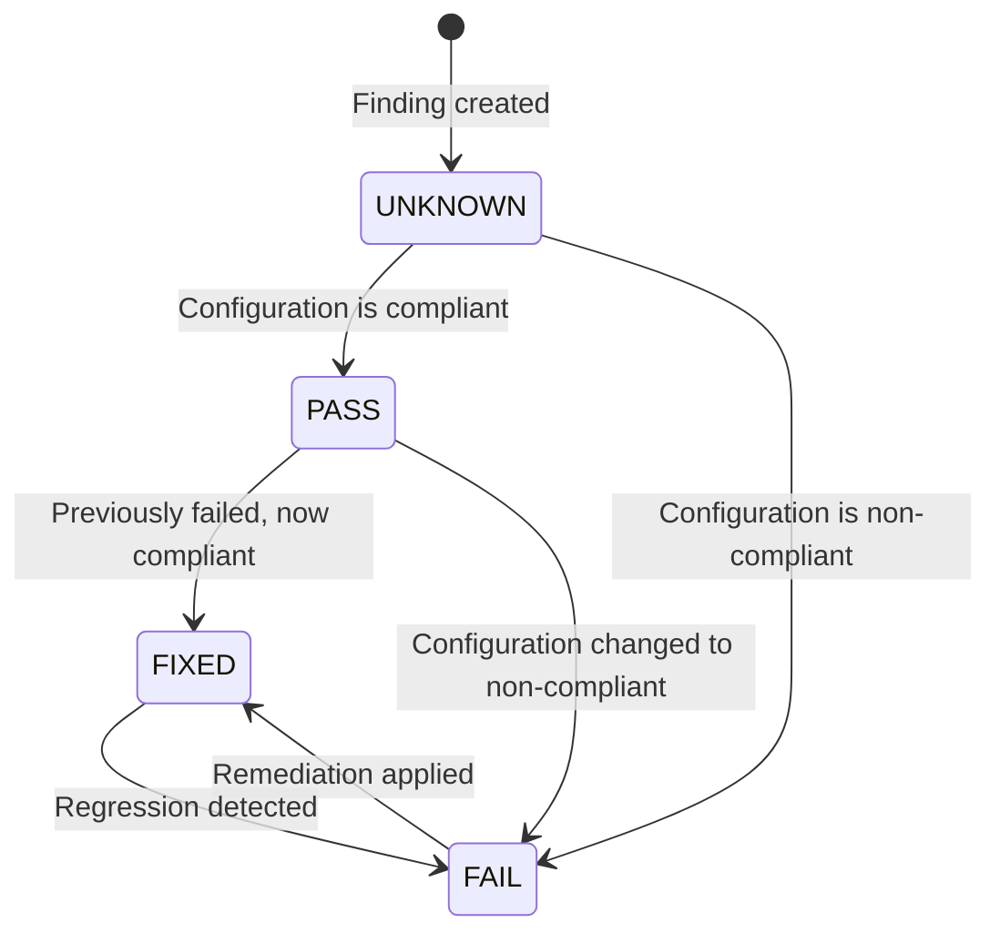
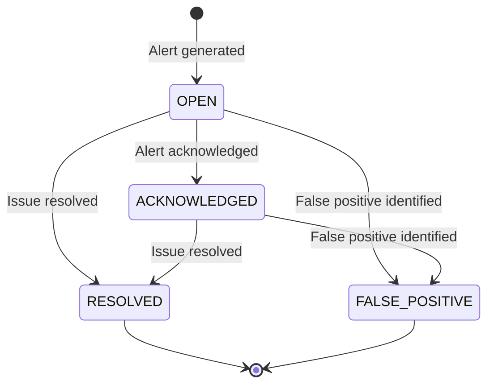

# CIS Compliance Data Model

## Entities

### 1. CIS Assessment

**Purpose**: Represents a single CIS benchmark assessment run against the system.

**Attributes**:
- `assessment_id` (UUID, PK): Unique identifier for the assessment
- `timestamp` (datetime): When the assessment was run
- `benchmark_version` (string): CIS benchmark version used
- `compliance_score` (float): Overall compliance score (0-100%)
- `total_controls` (int): Total number of CIS controls assessed
- `passed_controls` (int): Number of controls that passed
- `failed_controls` (int): Number of controls that failed
- `status` (enum): Assessment status (PENDING, COMPLETE, FAILED)
- `duration_seconds` (int): Time taken to complete assessment
- `assessed_by` (string): User/system that initiated assessment

**Relationships**:
- Has many `CISFinding` records (one-to-many)
- Belongs to `SecurityConfiguration` (many-to-one)

### 2. CIS Finding

**Purpose**: Represents an individual finding from a CIS benchmark assessment.

**Attributes**:
- `finding_id` (UUID, PK): Unique identifier for the finding
- `assessment_id` (UUID, FK): Assessment this finding belongs to
- `control_id` (string): CIS control identifier (e.g., "5.1.1")
- `control_description` (text): Description of the CIS control
- `control_category` (string): Category of the control (e.g., "Audit Logging")
- `current_value` (string): Current configuration value
- `expected_value` (string): Expected/compliant value
- `severity` (enum): Severity level (LOW, MEDIUM, HIGH, CRITICAL)
- `remediation` (text): Steps to remediate the finding
- `status` (enum): Finding status (PASS, FAIL, UNKNOWN, FIXED)
- `first_detected` (datetime): When first detected
- `last_updated` (datetime): When last updated
- `resolved_timestamp` (datetime, nullable): When resolved
- `resolved_by` (string, nullable): Who resolved it

**Relationships**:
- Belongs to `CISAssessment` (many-to-one)
- Related to `SecurityConfiguration` (many-to-one)

### 3. Security Configuration

**Purpose**: Represents a system configuration that can be assessed against CIS benchmarks.

**Attributes**:
- `config_id` (UUID, PK): Unique identifier for the configuration
- `config_key` (string): Configuration key/identifier
- `config_value` (string): Current configuration value
- `cis_recommendation` (string): CIS recommended value
- `compliance_status` (enum): Compliance status (COMPLIANT, NON_COMPLIANT, PENDING, EXEMPT)
- `config_type` (enum): Type of configuration (OS, DATABASE, APPLICATION, NETWORK, CONTAINER)
- `config_source` (string): Source file/location of configuration
- `last_assessed` (datetime): When last assessed
- `last_modified` (datetime): When last modified
- `modified_by` (string): Who last modified it
- `exemption_reason` (text, nullable): Reason for exemption if applicable
- `exemption_approved_by` (string, nullable): Who approved exemption
- `exemption_expires` (datetime, nullable): When exemption expires

**Relationships**:
- Has many `CISFinding` records (one-to-many)
- Has many `CISAssessment` records (one-to-many)
- Related to `ComplianceAlert` (one-to-many)

### 4. Compliance Alert

**Purpose**: Represents an alert generated when a compliance violation is detected.

**Attributes**:
- `alert_id` (UUID, PK): Unique identifier for the alert
- `alert_timestamp` (datetime): When the alert was generated
- `severity` (enum): Alert severity (INFO, WARNING, CRITICAL)
- `affected_configuration` (string): Configuration that triggered alert
- `current_value` (string): Current non-compliant value
- `expected_value` (string): Expected compliant value
- `remediation_steps` (text): Steps to resolve the issue
- `status` (enum): Alert status (OPEN, ACKNOWLEDGED, RESOLVED, FALSE_POSITIVE)
- `resolved_timestamp` (datetime, nullable): When resolved
- `resolved_by` (string, nullable): Who resolved it
- `resolution_notes` (text, nullable): Notes on resolution
- `related_finding_id` (UUID, FK, nullable): Related CIS finding if applicable
- `source` (enum): Alert source (AUTOMATED_SCAN, MANUAL_CHECK, EXTERNAL_AUDIT)

**Relationships**:
- Belongs to `SecurityConfiguration` (many-to-one)
- Related to `CISFinding` (many-to-one)

### 5. Compliance Report

**Purpose**: Represents a formal compliance report generated for audit purposes.

**Attributes**:
- `report_id` (UUID, PK): Unique identifier for the report
- `report_name` (string): Name/title of the report
- `generated_timestamp` (datetime): When report was generated
- `report_period_start` (datetime): Start period for report
- `report_period_end` (datetime): End period for report
- `compliance_score` (float): Overall compliance score
- `critical_findings` (int): Number of critical findings
- `high_findings` (int): Number of high severity findings
- `medium_findings` (int): Number of medium severity findings
- `low_findings` (int): Number of low severity findings
- `report_format` (enum): Format (PDF, JSON, CSV, HTML)
- `generated_by` (string): Who generated the report
- `report_status` (enum): Status (DRAFT, FINAL, ARCHIVED)
- `file_path` (string): Path to generated report file
- `file_size` (int): Size of report file in bytes
- `file_hash` (string): Hash of report file for integrity

**Relationships**:
- References multiple `CISAssessment` records (many-to-many via report_assessments junction table)

### 6. Hardening Operation

**Purpose**: Represents a security hardening operation that was applied to the system.

**Attributes**:
- `operation_id` (UUID, PK): Unique identifier for the operation
- `operation_timestamp` (datetime): When operation was initiated
- `operation_type` (enum): Type of operation (AUTOMATED, MANUAL, ROLLBACK)
- `status` (enum): Operation status (PENDING, IN_PROGRESS, COMPLETE, FAILED, ROLLED_BACK)
- `initiated_by` (string): Who initiated the operation
- `target_configurations` (JSON): List of configurations targeted
- `changes_applied` (JSON): Changes that were applied
- `rollback_available` (boolean): Whether rollback is possible
- `rollback_instructions` (text, nullable): Instructions for rollback
- `completed_timestamp` (datetime, nullable): When completed
- `notes` (text, nullable): Additional notes
- `pre_operation_snapshot` (string): Snapshot/backup reference
- `post_operation_snapshot` (string): Post-operation snapshot reference

**Relationships**:
- Affects many `SecurityConfiguration` records (many-to-many via operation_configurations junction table)

## Database Schema

```sql
-- CIS Assessment Table
CREATE TABLE cis_assessments (
    assessment_id UUID PRIMARY KEY,
    timestamp TIMESTAMPTZ NOT NULL,
    benchmark_version VARCHAR(50) NOT NULL,
    compliance_score FLOAT NOT NULL,
    total_controls INTEGER NOT NULL,
    passed_controls INTEGER NOT NULL,
    failed_controls INTEGER NOT NULL,
    status VARCHAR(20) NOT NULL,
    duration_seconds INTEGER,
    assessed_by VARCHAR(100)
);

-- CIS Finding Table
CREATE TABLE cis_findings (
    finding_id UUID PRIMARY KEY,
    assessment_id UUID REFERENCES cis_assessments(assessment_id),
    control_id VARCHAR(50) NOT NULL,
    control_description TEXT,
    control_category VARCHAR(100),
    current_value TEXT,
    expected_value TEXT,
    severity VARCHAR(20) NOT NULL,
    remediation TEXT,
    status VARCHAR(20) NOT NULL,
    first_detected TIMESTAMPTZ NOT NULL,
    last_updated TIMESTAMPTZ NOT NULL,
    resolved_timestamp TIMESTAMPTZ,
    resolved_by VARCHAR(100)
);

-- Security Configuration Table
CREATE TABLE security_configurations (
    config_id UUID PRIMARY KEY,
    config_key VARCHAR(255) NOT NULL UNIQUE,
    config_value TEXT,
    cis_recommendation TEXT,
    compliance_status VARCHAR(20) NOT NULL,
    config_type VARCHAR(50) NOT NULL,
    config_source VARCHAR(255),
    last_assessed TIMESTAMPTZ,
    last_modified TIMESTAMPTZ,
    modified_by VARCHAR(100),
    exemption_reason TEXT,
    exemption_approved_by VARCHAR(100),
    exemption_expires TIMESTAMPTZ
);

-- Compliance Alert Table
CREATE TABLE compliance_alerts (
    alert_id UUID PRIMARY KEY,
    alert_timestamp TIMESTAMPTZ NOT NULL,
    severity VARCHAR(20) NOT NULL,
    affected_configuration VARCHAR(255) NOT NULL,
    current_value TEXT,
    expected_value TEXT,
    remediation_steps TEXT,
    status VARCHAR(20) NOT NULL,
    resolved_timestamp TIMESTAMPTZ,
    resolved_by VARCHAR(100),
    resolution_notes TEXT,
    related_finding_id UUID REFERENCES cis_findings(finding_id),
    source VARCHAR(50) NOT NULL
);

-- Compliance Report Table
CREATE TABLE compliance_reports (
    report_id UUID PRIMARY KEY,
    report_name VARCHAR(255) NOT NULL,
    generated_timestamp TIMESTAMPTZ NOT NULL,
    report_period_start TIMESTAMPTZ NOT NULL,
    report_period_end TIMESTAMPTZ NOT NULL,
    compliance_score FLOAT NOT NULL,
    critical_findings INTEGER NOT NULL,
    high_findings INTEGER NOT NULL,
    medium_findings INTEGER NOT NULL,
    low_findings INTEGER NOT NULL,
    report_format VARCHAR(20) NOT NULL,
    generated_by VARCHAR(100),
    report_status VARCHAR(20) NOT NULL,
    file_path VARCHAR(512),
    file_size INTEGER,
    file_hash VARCHAR(128)
);

-- Report Assessments Junction Table
CREATE TABLE report_assessments (
    report_id UUID REFERENCES compliance_reports(report_id),
    assessment_id UUID REFERENCES cis_assessments(assessment_id),
    PRIMARY KEY (report_id, assessment_id)
);

-- Hardening Operation Table
CREATE TABLE hardening_operations (
    operation_id UUID PRIMARY KEY,
    operation_timestamp TIMESTAMPTZ NOT NULL,
    operation_type VARCHAR(20) NOT NULL,
    status VARCHAR(20) NOT NULL,
    initiated_by VARCHAR(100),
    target_configurations JSONB,
    changes_applied JSONB,
    rollback_available BOOLEAN NOT NULL DEFAULT FALSE,
    rollback_instructions TEXT,
    completed_timestamp TIMESTAMPTZ,
    notes TEXT,
    pre_operation_snapshot VARCHAR(255),
    post_operation_snapshot VARCHAR(255)
);

-- Operation Configurations Junction Table
CREATE TABLE operation_configurations (
    operation_id UUID REFERENCES hardening_operations(operation_id),
    config_id UUID REFERENCES security_configurations(config_id),
    PRIMARY KEY (operation_id, config_id)
);

-- Indexes for Performance
CREATE INDEX idx_cis_findings_assessment ON cis_findings(assessment_id);
CREATE INDEX idx_cis_findings_status ON cis_findings(status);
CREATE INDEX idx_cis_findings_severity ON cis_findings(severity);
CREATE INDEX idx_compliance_alerts_status ON compliance_alerts(status);
CREATE INDEX idx_compliance_alerts_severity ON compliance_alerts(severity);
CREATE INDEX idx_security_config_compliance ON security_configurations(compliance_status);
CREATE INDEX idx_security_config_type ON security_configurations(config_type);
```

## Data Flow



## API Data Models

### Request/Response Models

**Assessment Request**
```python
class AssessmentRequest(BaseModel):
    benchmark_version: str = "latest"
    scope: List[str] = ["os", "database", "application", "network"]
    schedule: Optional[str] = None  # Cron expression for scheduled assessment
    notify: Optional[List[str]] = None  # Email addresses to notify
```

**Assessment Response**
```python
class AssessmentResponse(BaseModel):
    assessment_id: UUID
    status: str
    timestamp: datetime
    estimated_completion: Optional[datetime]
    message: str
```

**Hardening Request**
```python
class HardeningRequest(BaseModel):
    config_ids: Optional[List[UUID]] = None  # Specific configs to harden
    scope: Optional[List[str]] = None  # Scope: os, database, application, network
    dry_run: bool = False  # Test without applying changes
    backup: bool = True  # Create backup before hardening
    schedule: Optional[str] = None  # Schedule for later execution
```

**Hardening Response**
```python
class HardeningResponse(BaseModel):
    operation_id: UUID
    status: str
    affected_configs: List[UUID]
    changes_summary: Dict[str, Dict[str, str]]  # {config_key: {old: value, new: value}}
    backup_created: bool
    backup_location: Optional[str]
    rollback_available: bool
    rollback_instructions: Optional[str]
```

**Alert Response**
```python
class AlertResponse(BaseModel):
    alert_id: UUID
    severity: str
    affected_configuration: str
    current_value: str
    expected_value: str
    remediation_steps: str
    status: str
    created_at: datetime
```

## Validation Rules

### CIS Assessment Validation
- `compliance_score` must be between 0 and 100
- `total_controls = passed_controls + failed_controls`
- `timestamp` must be in the past
- `benchmark_version` must match known CIS benchmark versions

### Security Configuration Validation
- `config_key` must be unique
- `compliance_status` must be one of: COMPLIANT, NON_COMPLIANT, PENDING, EXEMPT
- If `exemption_reason` is provided, `exemption_approved_by` and `exemption_expires` must also be provided
- `exemption_expires` must be in the future

### Compliance Alert Validation
- `severity` must be one of: INFO, WARNING, CRITICAL
- `status` must be one of: OPEN, ACKNOWLEDGED, RESOLVED, FALSE_POSITIVE
- If `status = RESOLVED`, `resolved_timestamp` and `resolved_by` must be provided
- `resolved_timestamp` must be after `alert_timestamp`

## State Transitions

### CIS Assessment Lifecycle


### CIS Finding Lifecycle


### Compliance Alert Lifecycle


## Data Retention Policy

- **CIS Assessments**: Retain for 2 years
- **CIS Findings**: Retain for 2 years, or until resolved + 1 year
- **Security Configurations**: Retain indefinitely (current state)
- **Compliance Alerts**: Retain for 1 year after resolution
- **Compliance Reports**: Retain for 7 years (audit requirements)
- **Hardening Operations**: Retain for 5 years

## Backup Strategy

- **Database Backups**: Daily full backups, retained for 30 days
- **Configuration Snapshots**: Created before each hardening operation
- **Report Archives**: PDF reports archived with cryptographic hashes
- **Audit Logs**: All compliance-related changes logged and retained for 7 years

## Security Considerations

- **Access Control**: Compliance data accessible only to security administrators
- **Audit Logging**: All compliance operations logged with timestamps and user information
- **Data Integrity**: Cryptographic hashes for compliance reports
- **Encryption**: Sensitive compliance data encrypted at rest
- **Retention**: Compliance with data protection regulations for retention periods
